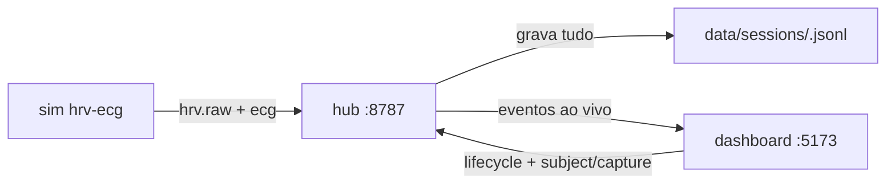

# Como Usar — Runbook das Novas Features

Passo a passo prático para **rodar e usar** as 4 features ponta a ponta:
cadastro do **Subject** → configuração de **Recording** → **Live** → **Export** `.npy`/`.mat`.

Funciona **sem hardware** (com ECG sintético). As diferenças com o Polar real estão no fim.

> Para subir o sistema em si (portas, com/sem Polar, troubleshooting), veja [GUIA-PROJETO.md](GUIA-PROJETO.md).

---

## 0. Pré-requisitos

```powershell
winget install OpenJS.NodeJS.LTS
winget install Python.Python.3.11
# feche e reabra o terminal depois de instalar
```

---

## 1. Subir a stack (demo sem hardware)

Três terminais, na pasta `hub-ue/`:

```powershell
# preparar (uma vez)
cd hub-ue
python -m venv .venv
.\.venv\Scripts\python -m pip install -e apps\hub
```

```powershell
.\.venv\Scripts\biofeedback-hub                  # Terminal 1 — hub (:8787)
```
```powershell
npm install ; npm run dev:dashboard              # Terminal 2 — dashboard (:5173)
```
```powershell
.\.venv\Scripts\biofeedback-sim --mode hrv-ecg   # Terminal 3 — sensor + ECG sintético
```

Abra **http://127.0.0.1:5173**. No topo deve aparecer **Connected** e um `session-...` (guarde esse **sessionId**, é usado no passo 6).



---

## 2. Cadastrar o sujeito — aba **Subject**

1. Clique em **Subject** na barra lateral.
2. Preencha **Subject ID** (pseudônimo, ex.: `S-2026-014`) e os campos de demografia/confundidores (cafeína, sono, etc.).
3. Marque **"Consinto com a coleta..."**.
4. O selo deve mudar para **"Pronto para iniciar"**.

> O perfil é salvo localmente (localStorage) e anexado à experiência ao iniciar.

---

## 3. Configurar a gravação — aba **Recording**

1. Clique em **Recording**.
2. Escolha o **modo**: `Stream-only`, `Record` ou `Hybrid`.
3. Em **Sensores e sinais**, marque os sinais por sensor (ex.: `hrv-ecg-sim` → ECG / RR / HR).
4. Opcional: **Capturar ECG bruto em arquivo**.

> Essa configuração (`capture`) é publicada junto do `experience.lifecycle started`.

---

## 4. Iniciar e ver ao vivo — **Session Control** + **Live**

1. Vá em **Session Control** e clique em **Start experience**.
   - Isso publica `experience.lifecycle started` com **subject + capture** (vai para o log do hub).
2. Abra a aba **Live**:
   - 🟢 **ECG ao vivo** no canvas (graças ao `--mode hrv-ecg`);
   - **HR/RR** (gráficos) e **BPM/RR** atuais.

> Com `--mode hrv` (sem ECG), o painel de ECG fica vazio; HR/RR continuam funcionando.

---

## 5. Encerrar

Em **Session Control**, clique em **End experience**. Isso publica `experience.lifecycle ended` e abre o **Report** (que você pode exportar em JSON/CSV — já com `subject`/`capture` embutidos).

---

## 6. Exportar `.npy` / `.mat`

O exportador lê o **log JSONL do hub** — então funciona **mesmo no demo sem hardware**
(o sim `hrv-ecg` grava ECG no log; a dashboard grava `subject`/`capture` no lifecycle).

Num novo terminal, na pasta `polarh10_driver/`:

```powershell
cd polarh10_driver
python -m venv .venv
.\.venv\Scripts\python -m pip install numpy scipy
```

Descubra o **sessionId** (topo do dashboard) ou:

```powershell
Invoke-RestMethod http://127.0.0.1:8787/health | Select-Object sessionId
```

Exporte (o log do hub fica em `hub-ue/data/sessions/`):

```powershell
# ECG bruto -> NPY
.\.venv\Scripts\python -m tools.export_cli --session <sessionId> `
  --sessions-dir ..\hub-ue\data\sessions --signal ecg --format npy --out ecg.npy

# RR -> MAT
.\.venv\Scripts\python -m tools.export_cli --session <sessionId> `
  --sessions-dir ..\hub-ue\data\sessions --signal rr --format mat --out rr.mat
```

Saída: o arquivo binário (`ecg.npy` / `rr.mat`) **+** um sidecar **`ecg.meta.json`** com
`subject` + `capture` + `run`. Sinais aceitos: `ecg`, `rr`, `hr`. Formatos: `npy`, `mat`.

---

## Com o Polar H10 real (diferenças)

Em vez do simulador, suba o driver e a ponte (ver [GUIA-PROJETO.md](GUIA-PROJETO.md) seção 6):

1. `python main.py` no `polarh10_driver` (driver em `:8765`).
2. `biofeedback-polarh10` (a ponte; **sem** `--disable-recording-control`, já que o `/control` agora existe).

Aí, além do export pelo JSONL, o **driver grava o ECG bruto em arquivo** durante a experiência:
`polarh10_driver/data/recordings/<runId>_<device>_ecg.{csv,npy}` (acionado pelo lifecycle via `/control`).

---

## Mapa das abas do dashboard

| Aba | Para quê |
|---|---|
| **Overview** | Saúde do sistema, sensores, eventos recentes |
| **Live** | ECG ao vivo (canvas) + HR/RR |
| **Subject** | Cadastro do sujeito + confundidores + consentimento |
| **Recording** | Modo de gravação + seleção de sensores/sinais |
| **Session Control** | Start/End experience, markers, timeline, Report/exports |
| **Clients** | Clientes conectados ao hub |
| **Topics** | Stream de eventos por tópico |
| **Diagnostics** | Endpoint/token do hub |
