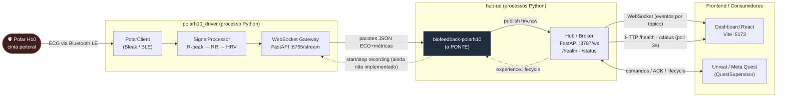
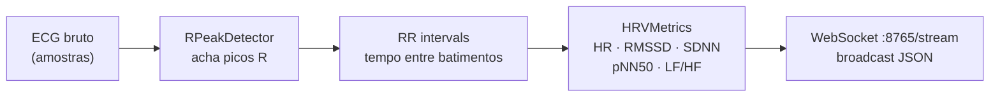
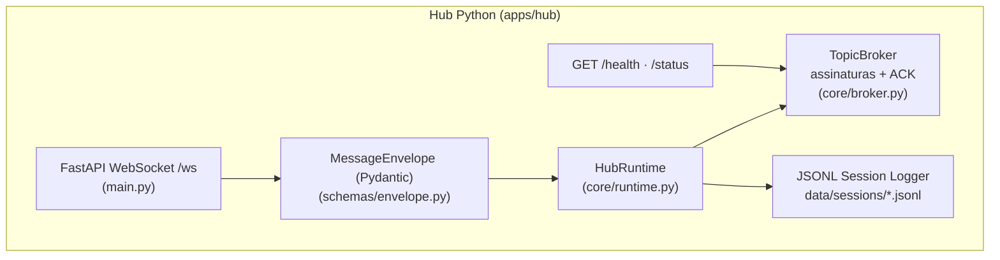
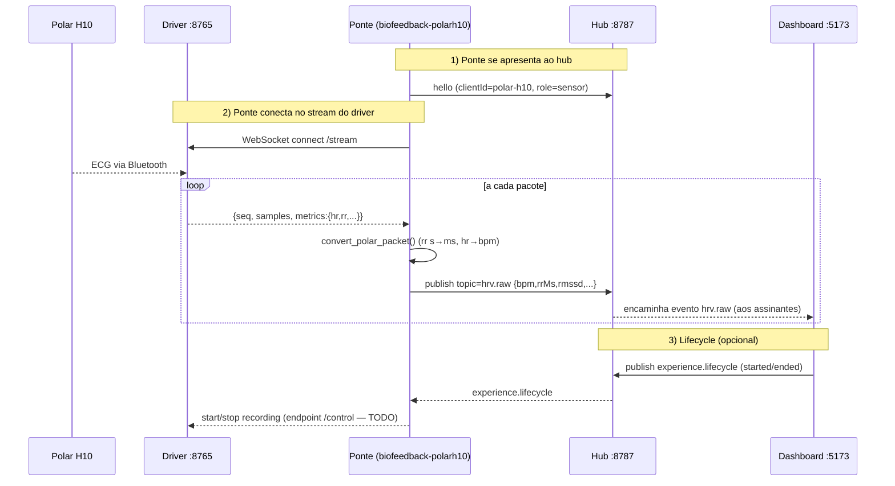
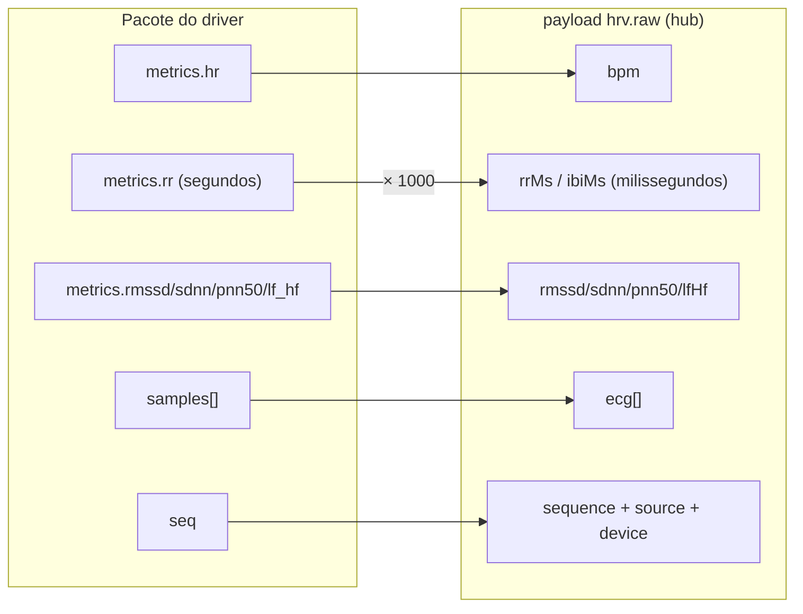
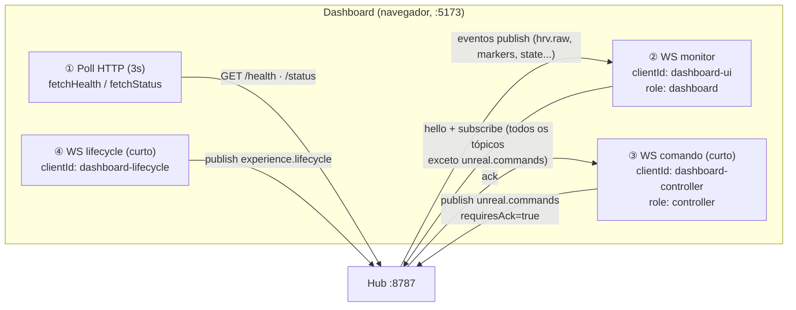
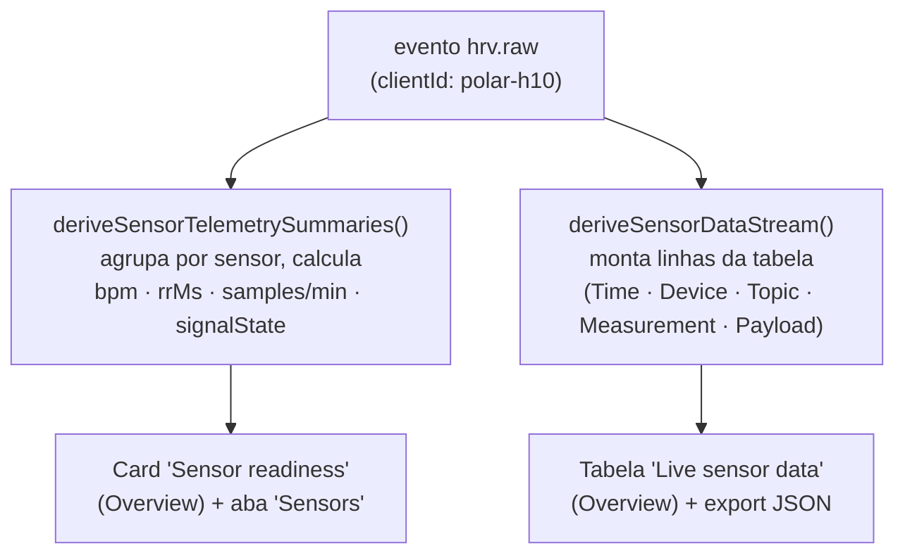
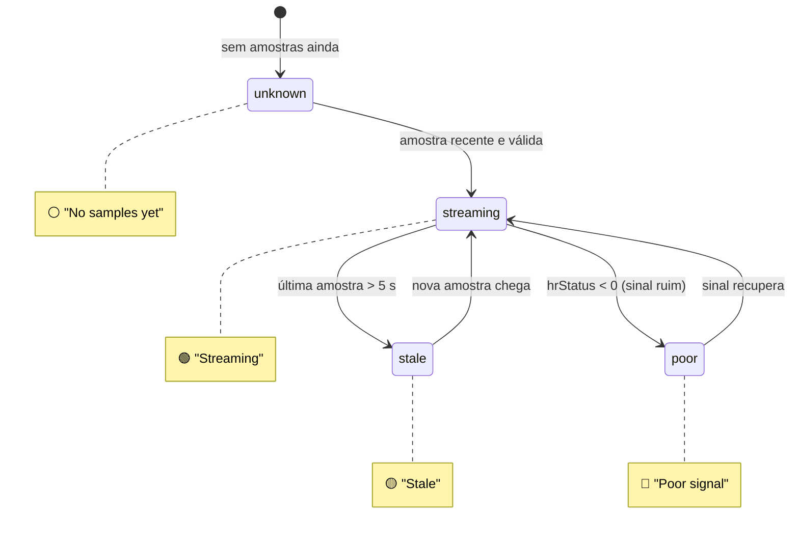
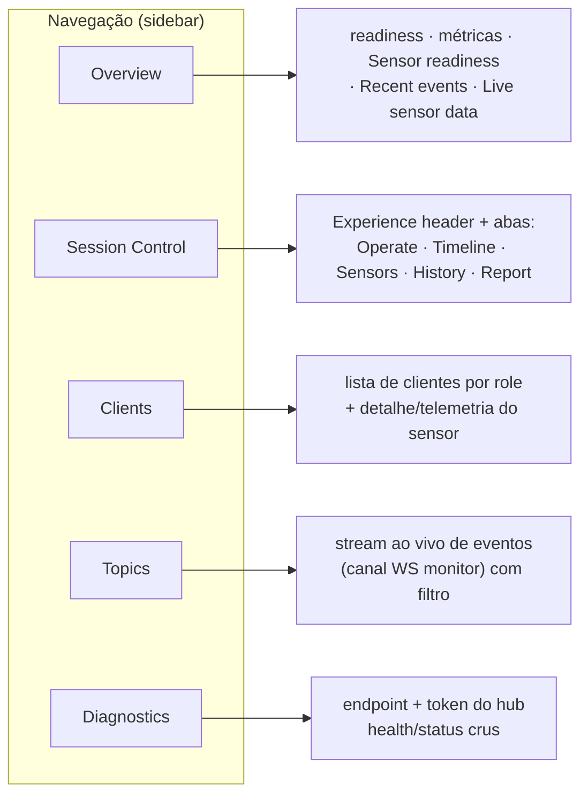
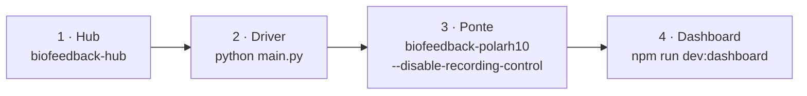

# Guia do Projeto — Biofeedback Hub + Polar H10

Guia visual de **como o sistema funciona hoje**, **como os dois projetos se conectam** e **como o dashboard consome esses dados**. Os diagramas usam [Mermaid](https://mermaid.js.org/) e são renderizados direto no GitHub/VS Code (com a extensão *Markdown Preview Mermaid Support*).

```
hUB-TTG/
├── hub-ue/            # Hub central (broker WebSocket) + dashboard React + plugin Unreal
└── polarh10_driver/   # Driver do sensor Polar H10 (ECG por Bluetooth → HRV → WebSocket)
```

> Os `.git` de cada pasta mostram que são **dois repositórios independentes**. Eles só se falam em tempo de execução, pela ponte descrita na seção 3.

---

## 1. Mapa geral do sistema

Cada caixa é um **processo** rodando na sua máquina. As setas mostram o sentido dos dados e o transporte.



**Leitura rápida:** o Polar manda ECG por Bluetooth → o **driver** calcula HRV e expõe num WebSocket próprio (`:8765`) → a **ponte** lê esse stream e republica no **hub** (`:8787`) como tópico `hrv.raw` → o **dashboard** assina o hub e mostra tudo. O Unreal entra pelo mesmo hub, em outros tópicos.

---

## 2. O que cada projeto faz

### 2.1. `polarh10_driver` — o sensor

Pipeline ponta a ponta:



| Arquivo | Responsabilidade |
|---|---|
| [main.py](polarh10_driver/main.py) | Entrada. Carrega config, conecta o Polar, escolhe o gateway. |
| [core/polar_client.py](polarh10_driver/core/polar_client.py) | Acha o Polar (Bleak), inicia o stream de ECG, enfileira pacotes. |
| [core/signal_processor.py](polarh10_driver/core/signal_processor.py) | Buffer de sinal, chama o detector e calcula RR. |
| [core/rpeak_detector.py](polarh10_driver/core/rpeak_detector.py) | Detecta picos R (limiar adaptativo + período refratário). |
| [core/hrv_metrics.py](polarh10_driver/core/hrv_metrics.py) | Calcula HR, RMSSD, SDNN, pNN50, LF/HF. |
| [core/websocket_gateway.py](polarh10_driver/core/websocket_gateway.py) | Gateway WebSocket "puro". |
| [core/websocket_gateway_dashboard.py](polarh10_driver/core/websocket_gateway_dashboard.py) | Gateway + página HTML de visualização em `/`. |
| [config/config.yaml](polarh10_driver/config/config.yaml) | Endereço BLE, taxa de amostragem, porta, path do WS, visualização. |

**Pacote enviado pelo `/stream`:**

```json
{
  "type": "ecg",
  "seq": 1,
  "timestamp": 1719000000.123,
  "samples": [123, 124, 121, 119],
  "metrics": { "rr": 0.82, "hr": 73.1, "rmssd": 32.5,
               "sdnn": 40.2, "pnn50": 0.12, "lf_hf": 1.8 }
}
```

> `visualization.enabled: true` no `config.yaml` faz subir o gateway com a página HTML em `http://localhost:8765/` (ECG ao vivo com Chart.js). Com `false`, sobe o gateway simples.

### 2.2. `hub-ue` — o hub central

O hub é um **broker por tópicos**: clientes conectam, dizem quem são (`hello`), assinam tópicos (`subscribe`) e publicam (`publish`). O hub valida, carimba, grava log JSONL e reencaminha para os assinantes.



Partes do `hub-ue`:

| Pasta | O que é |
|---|---|
| `apps/hub` | Servidor Python (FastAPI + WS), broker, logger, CLIs e simuladores. |
| `apps/dashboard` | Dashboard React/Vite local (o foco da seção 4). |
| `unreal/Plugins/QuestSupervisor` | Plugin Unreal/Quest reutilizável. |

CLIs instaladas com o hub (ver [pyproject.toml](hub-ue/apps/hub/pyproject.toml)):

| Comando | Função |
|---|---|
| `biofeedback-hub` | Sobe o servidor do hub. |
| `biofeedback-sim` | Simuladores (`--mode hrv` / `unreal` / `logger` / `multi-sensor`). |
| `biofeedback-command` | Comandos críticos (pause/resume/add-marker) + ACK. |
| `biofeedback-status` | Lista clientes conectados (`/status`). |
| `biofeedback-doctor` | Diagnóstico do ambiente. |
| `biofeedback-experience` | Publica lifecycle (`started`/`ended`). |
| **`biofeedback-polarh10`** | **A ponte Polar ↔ Hub** (seção 3). |

Tópicos conhecidos ([schemas/topics.py](hub-ue/apps/hub/src/biofeedback_hub/schemas/topics.py)) — lista **aberta**: `experience.lifecycle`, `experience.marker`, `unreal.state`, `unreal.commands`, `hrv.raw`, `hrv.processed`, `eeg.raw`, `eeg.processed`, `biofeedback.events`, `ai.input`, `ai.output`, `logger.events`, `system.events`.

---

## 3. Como os dois projetos se conectam (a ponte)

O driver e o hub são **dois servidores WebSocket** — nenhum conecta no outro sozinho. Quem liga os dois é o cliente **`biofeedback-polarh10`** ([tools/polarh10_client.py](hub-ue/apps/hub/src/biofeedback_hub/tools/polarh10_client.py)), que é **cliente dos dois ao mesmo tempo**.

### 3.1. Handshake e fluxo (sequência)



### 3.2. Transformação do dado (driver → hub)

A ponte **traduz** o formato do driver para o envelope do hub (função `convert_polar_packet`):



A ponte também faz o caminho inverso: assina `experience.lifecycle` no hub e, quando o dashboard/Unreal manda `started`/`ended`, encaminharia um comando de gravação ao driver.

> ⚠️ **Estado atual:** o endpoint de controle `ws://localhost:8765/control` que a ponte usa para gravação **ainda não existe** no gateway do driver ([websocket_gateway.py](polarh10_driver/core/websocket_gateway.py) só expõe `/stream`). Por isso rode a ponte com **`--disable-recording-control`**. A telemetria (`/stream` → `hrv.raw`) funciona normalmente.

Endereços padrão da ponte (cada um configurável por flag):

| Flag | Padrão | Para quê |
|---|---|---|
| `--polar-ws` | `ws://localhost:8765/stream` | onde lê o ECG do driver |
| `--hub-ws` | `ws://127.0.0.1:8787/ws` | onde publica no hub |
| `--client-id` | `polar-h10` | identidade no hub (vira o sensor no dashboard) |
| `--disable-recording-control` | (desligado) | **use isto hoje** |

---

## 4. Como o dashboard se conecta e mostra os dados

Esta é a parte central do seu pedido. O dashboard (`apps/dashboard`, React/Vite em `:5173`) **não recebe nada do Polar diretamente** — ele fala **só com o hub**, por **quatro canais** distintos:



O que cada canal alimenta (ver [api.ts](hub-ue/apps/dashboard/src/api.ts) e [App.tsx](hub-ue/apps/dashboard/src/App.tsx)):

| # | Canal | Implementação | Alimenta na UI |
|---|---|---|---|
| ① | **Poll HTTP** a cada 3s | `fetchHealth` + `fetchStatus` | "System readiness", contagem de clientes, ACKs pendentes, lista de Clients |
| ② | **WS monitor** (longo) | `buildHello` + `buildMonitorSubscribe` | Tudo que é stream ao vivo: aba Topics, "Live sensor data", "Sensor readiness", timeline |
| ③ | **WS comando** (curto, por clique) | `publishUnrealCommand` | Botões Pause/Resume/Add marker → espera ACK (timeout 5s) |
| ④ | **WS lifecycle** (curto, por clique) | `publishLifecycleEvent` | Botões Start/End experience |

> O endpoint do hub fica salvo no `localStorage` e pode ser trocado na aba **Diagnostics** (padrão `http://127.0.0.1:8787`). O dashboard também **assina dinamicamente** tópicos novos de sensores que aparecem no `/status` (ex.: `imu.accelerometer.raw`).

### 4.1. Do `hrv.raw` ao card de sensor

Quando a ponte publica `hrv.raw`, o evento chega pelo canal ② e passa por duas funções de [sensorTelemetry.ts](hub-ue/apps/dashboard/src/sensorTelemetry.ts):



**Estado do sinal** de cada sensor (`deriveSignalState`) — é o que pinta o selo verde/amarelo/vermelho:



### 4.2. System readiness (como cada célula é decidida)

A faixa "System readiness" do Overview vem de `deriveReadiness` em [domain.ts](hub-ue/apps/dashboard/src/domain.ts), usando os dados do **poll HTTP**:

| Célula | Verde (ready) quando… | Senão |
|---|---|---|
| **Hub** | `/health` respondeu `ok` | 🔴 Offline |
| **Unreal / Quest** | há cliente com `role=unreal` | 🟡 Missing |
| **Sensors** | há cliente com `role=sensor` (ex.: a ponte Polar) | 🟡 Waiting |
| **ACKs** | nenhum ACK pendente | 🟡 N pending |
| **Logs** | há cliente `role=logger` | ⚪ Local |

### 4.3. As 5 telas do dashboard



Layout aproximado da tela **Overview** (onde o Polar aparece):

```text
┌──────────────┬─────────────────────────────────────────────────────────┐
│ Biofeedback  │  Overview                       [● Connected] session-... │
│ Hub          ├─────────────────────────────────────────────────────────┤
│              │  System readiness                                        │
│ ▸ Overview   │  [Session][Hub ✓][Unreal ⚠][Sensors ✓][ACKs ✓][Logs ⚪] │
│   Session    │  Clients: 2   Pending ACKs: 0   Topics: 6   Marker: --   │
│   Clients    │  ┌── Sensor readiness ───────────────────────────────┐   │
│   Topics     │  │ Polar H10 Lab Strap        [🟢 Streaming]         │   │
│   Diagnostics│  │ Sensors 1   BPM 73   RR 821 ms   Last sample: now │   │
│              │  └───────────────────────────────────────────────────┘   │
│              │  Required actions          Recent events                 │
│              │  ┌─────────────────┐       ┌───────────────────────────┐ │
│              │  │ • ...            │       │ hrv.raw  polar-h10  bpm73 │ │
│              │  └─────────────────┘       └───────────────────────────┘ │
│              │  Live sensor data                        [Save JSON]     │
│              │  Time     Device         Topic    Measurement   Payload  │
│              │  12:00:01 Polar H10 Lab  hrv.raw  73 BPM/821ms  bpm:73.. │
│              │  12:00:00 Polar H10 Lab  hrv.raw  72 BPM/833ms  bpm:72.. │
└──────────────┴─────────────────────────────────────────────────────────┘
```

> Com vários sensores, o seletor **"Viewing"** no card *Sensor readiness* alterna entre eles. A tabela *Live sensor data* aceita qualquer dispositivo WebSocket com tópico/payload de sensor, não só o Polar.

---

## 5. Como rodar — SEM o Polar (primeiro teste)

Valida hub + dashboard sem hardware, usando o simulador de HRV. Três terminais em `hub-ue/`.

```powershell
# preparar (uma vez)
cd hub-ue
python -m venv .venv
.\.venv\Scripts\python -m pip install -e apps\hub
```

```powershell
# Terminal 1 — hub
cd hub-ue
.\.venv\Scripts\biofeedback-hub
```

```powershell
# Terminal 2 — dashboard
cd hub-ue
npm install
npm run dev:dashboard      # abre http://127.0.0.1:5173
```

```powershell
# Terminal 3 — simulador de HRV (publica em hrv.raw)
cd hub-ue
.\.venv\Scripts\biofeedback-sim --mode hrv
```

No dashboard, o card *Sensor readiness* deve mostrar o sensor simulado em 🟢 Streaming. Atalho que sobe tudo junto (hub na porta 8788): `npm run dev:demo` (parar: `npm run dev:demo:stop`).

---

## 6. Como rodar — COM o Polar H10 (pipeline completo)

Precisa do **Polar H10 físico** (eletrodos úmidos, cinta vestida) e Bluetooth no PC.



**Passo 1 — Hub** (em `hub-ue/`):

```powershell
cd hub-ue
python -m venv .venv
.\.venv\Scripts\python -m pip install -e apps\hub
.\.venv\Scripts\biofeedback-hub
```

**Passo 2 — Driver do Polar** (em `polarh10_driver/`):

```powershell
cd polarh10_driver
python -m venv .venv
.\.venv\Scripts\python -m pip install -r requirements.txt
```

Descubra o endereço Bluetooth do **seu** Polar e ajuste [config/config.yaml](polarh10_driver/config/config.yaml):

```powershell
.\.venv\Scripts\python -c "import asyncio; from bleak import BleakScanner; print(asyncio.run(BleakScanner.discover()))"
```

Edite `config.yaml` → `bluetooth.device_address` (no Windows costuma ser `XX:XX:XX:XX:XX:XX`; o valor que vem no arquivo é um UUID de macOS). Depois:

```powershell
.\.venv\Scripts\python main.py
```

**Passo 3 — Ponte** (no venv do **hub**):

```powershell
cd hub-ue
.\.venv\Scripts\biofeedback-polarh10 --disable-recording-control
```

Você verá `seq=... bpm=... rrMs=... ecg_samples=... -> hrv.raw`.

**Passo 4 — Dashboard:**

```powershell
cd hub-ue
npm run dev:dashboard      # http://127.0.0.1:5173
```

O HRV real do Polar aparece em *Sensor readiness* e *Live sensor data*.

---

## 7. Portas e endpoints

| Serviço | Endereço |
|---|---|
| Driver Polar — stream | `ws://localhost:8765/stream` |
| Driver Polar — visualização HTML | `http://localhost:8765/` |
| Hub — WebSocket | `ws://127.0.0.1:8787/ws` |
| Hub — health / status | `http://127.0.0.1:8787/health` · `/status` |
| Dashboard | `http://127.0.0.1:5173` |
| Hub no modo demo | `http://127.0.0.1:8788` |

---

## 8. Resolução de problemas

| Sintoma | Causa provável / solução |
|---|---|
| `Polar device not found` | Endereço errado em `config.yaml`, sensor desligado ou eletrodos secos. Reescaneie (Passo 2). |
| Ponte fica tentando `/control` | Adicione `--disable-recording-control` (o driver atual não tem esse endpoint). |
| Dashboard sem dados | Confira a ordem (hub **antes** da ponte). Veja `http://127.0.0.1:8787/status` ou rode `biofeedback-status`. |
| Sensor aparece 🟡 *Stale* | Sem amostra há >5 s — o driver parou de enviar ou o Polar perdeu contato. |
| Sensor aparece 🔴 *Poor signal* | `hrStatus < 0` — contato ruim da cinta/eletrodos. |
| `venv_setup.sh` não roda no Windows | É script bash; use os comandos PowerShell das seções 5–6. |
| Faltam `fastapi`/`uvicorn` | Rode `python -m pip install -e apps\hub` dentro de `hub-ue`. |

---

## 9. Para aprofundar

- [hub-ue/README.md](hub-ue/README.md) — quick start oficial do hub.
- [hub-ue/docs/architecture.md](hub-ue/docs/architecture.md) — arquitetura do hub.
- [hub-ue/docs/protocol.md](hub-ue/docs/protocol.md) — envelope, tópicos e ACK.
- [hub-ue/docs/websocket-device-integration.md](hub-ue/docs/websocket-device-integration.md) — contrato `hrv.raw` para qualquer dispositivo.
- [hub-ue/apps/dashboard/README.md](hub-ue/apps/dashboard/README.md) — Session Control, Report e exports.
- [polarh10_driver/README.md](polarh10_driver/README.md) — stream e métricas do Polar.
- [hub-ue/apps/hub/src/biofeedback_hub/tools/polarh10_client.py](hub-ue/apps/hub/src/biofeedback_hub/tools/polarh10_client.py) — código da ponte.
- [hub-ue/apps/dashboard/src/sensorTelemetry.ts](hub-ue/apps/dashboard/src/sensorTelemetry.ts) — como o dashboard interpreta os sensores.
</content>
