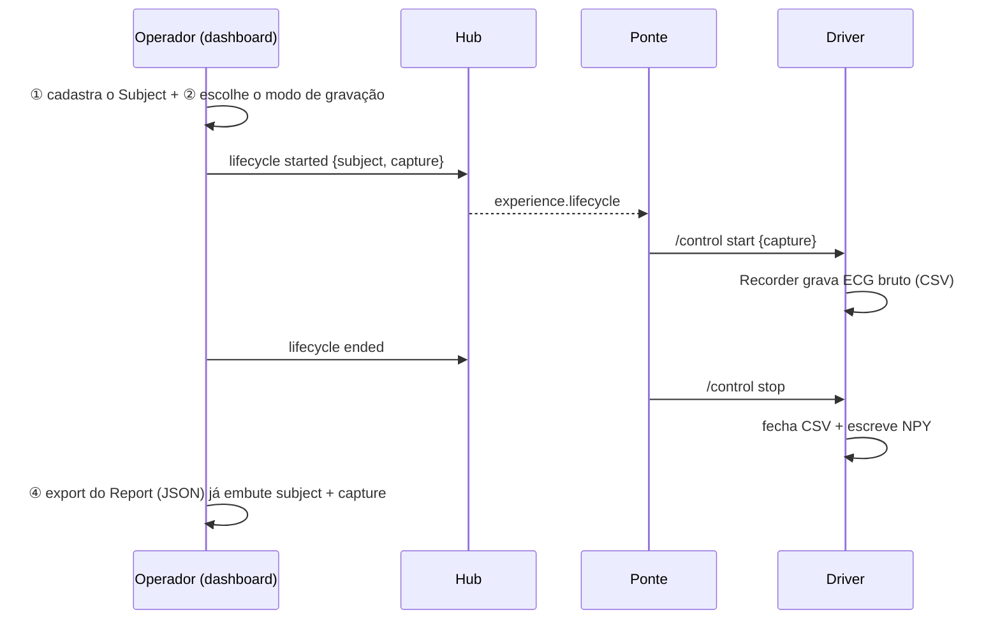

# Mudanças e Estado Atual — HUB-NOSSO

Registro de tudo que foi feito neste repositório: a criação do monorepo, a infraestrutura
(CI) e a implementação das **Fases 0 a 4** — as **4 exigências do cliente concluídas**.
Inclui o mapa de arquivos novos/alterados e o estado atual de cada exigência.

Documentos relacionados: [README.md](README.md) · [GUIA-PROJETO.md](GUIA-PROJETO.md) · [PLANO-NOVAS-FEATURES.md](PLANO-NOVAS-FEATURES.md) · [docs de decisões](hub-ue/docs/decisions-novas-features.md)

---

## 1. Estado atual (resumo)

- **Repositório:** monorepo único em `github.com/VictorBarretoAndrade/HUB-NOSSO`, branch `main`.
- **Conteúdo:** os dois projetos (`hub-ue` + `polarh10_driver`) + guias + scaffolding + Fases 0–4 (todas as 4 exigências).
- **CI:** GitHub Actions valida cada push (dashboard, hub e driver). **Verde** em todas as fases.
- **Branches:** `main` (tudo consolidado) + `feat/fase-0-fundacao`, `feat/fase-1-sujeito`, `feat/fase-2-gravacao`, `feat/fase-3-export`, `feat/fase-4-live`.

### Progresso das exigências

| # | Exigência | Status |
|---|---|---|
| ① | Cadastro da pessoa + confundidores | ✅ **Implementado** (Fase 1) |
| ② | Modos de gravação + seleção de sensores | ✅ **Implementado** (Fase 2) |
| ③ | Visualização ao vivo | ✅ **Implementado** (Fase 4) — ECG em canvas + HR/RR ao vivo |
| ④ | Salvamento `.npy`/`.mat` | ✅ **Implementado** (Fase 3) — export server-side do JSONL, com metadados |

> **As 4 exigências do cliente estão implementadas e validadas por CI.**

### Histórico de commits (main)

```
5a5087f  feat(fase-4): visualização ao vivo (ECG canvas + HR/RR) — fecha as 4 exigências
ba1229c  feat(fase-3): export .npy/.mat server-side a partir do JSONL + metadados
fc58955  docs: adiciona MUDANCAS.md (changelog e estado atual das fases 0-2)
4f5f897  feat(fase-2): gravação no driver (/control + Recorder) + tela de modos
49bf460  ci: GitHub Actions valida dashboard (typecheck+vitest) e hub (unittest)
c10f154  feat(fase-1): tela de cadastro do sujeito + binding na experiência
ed8b895  feat(fase-0): export embute subject/capture (fundação das novas features)
3667770  docs: adiciona README da raiz do monorepo
f54ec7b  Initial commit: Biofeedback Hub + Polar H10 (monorepo)
```

---

## 2. Setup do monorepo

Antes, `hub-ue` e `polarh10_driver` eram repositórios Git separados (de terceiros: `Viperpog/hub-ue` e `biancacmendes/polarh10_driver`), e a pasta raiz não era um repo.

O que foi feito:
- Os `.git` aninhados foram **renomeados para `.git.backup`** (reversível, nada deletado) para a raiz virar um repo único.
- `git init` na raiz + [.gitignore](.gitignore) (ignora `node_modules`, `.venv`, `__pycache__`, Unreal `Binaries/Intermediate/Saved`, `data/sessions`, `data/recordings`, os `.git.backup`).
- Remote `origin` apontando para `HUB-NOSSO`.
- Histórico novo (os históricos antigos permanecem nos repos originais e nos `.git.backup` locais).

> Para recuperar o histórico antigo de um subprojeto: renomeie `*/.git.backup` de volta para `*/.git`.

---

## 3. Infraestrutura: CI

Arquivo: [.github/workflows/ci.yml](.github/workflows/ci.yml) — roda a cada push e PR. Como o ambiente local não tinha Node/Python, o CI passou a ser a validação principal.

| Job | O que roda |
|---|---|
| **dashboard** | `npm ci` → `typecheck:dashboard` (tsc) → `vitest` |
| **hub** | `pip install -e` → `unittest` → `compileall` |
| **driver** | `pip install numpy` → testes do Recorder/control/export → `compileall` |

---

## 4. Mudanças por fase

### Fase 0 — Fundação (contratos + export v2)

Estabelece os contratos compartilhados e permite que o export carregue contexto fisiológico.

**Novos contratos (dashboard, TypeScript):**
- [subjectProfile.ts](hub-ue/apps/dashboard/src/subjectProfile.ts) — tipos do sujeito + persistência + validação.
- [captureProfile.ts](hub-ue/apps/dashboard/src/captureProfile.ts) — `CaptureProfile`, builders, payload de lifecycle.
- [exportFormats.ts](hub-ue/apps/dashboard/src/exportFormats.ts) — `ExportJob`, regra client/server, **encoder `.npy` funcional**, `buildExportEnvelopeV2`.

**Contrato (hub, Python):**
- [schemas/capture.py](hub-ue/apps/hub/src/biofeedback_hub/schemas/capture.py) — Pydantic: `SubjectProfile`, `CaptureProfile`, `RecordingControl`, `ExportEnvelopeV2`.

**Integração:**
- [experienceReport.ts](hub-ue/apps/dashboard/src/experienceReport.ts) — o export do Report passa a embutir `subject`/`capture` **opcionais** (retrocompatível, `schemaVersion` 1 mantido).

**Apoio:**
- [docs/decisions-novas-features.md](hub-ue/docs/decisions-novas-features.md) — decision log (D1–D10).
- [docs/protocol.md](hub-ue/docs/protocol.md) — seção "Extensões propostas (schemaVersion 2)".

### Fase 1 — Cadastro do sujeito (①)

Tela de cadastro com o perfil fluindo para a sessão e os exports.

- [SubjectView.tsx](hub-ue/apps/dashboard/src/SubjectView.tsx) *(novo)* — formulário: ID pseudônimo, demografia (idade/sexo/altura/peso/posição), **confundidores de HRV** (cafeína, sono, álcool, exercício, nicotina, estresse, medicação) e **consentimento**, com validação.
- [App.tsx](hub-ue/apps/dashboard/src/App.tsx) — nova aba **Subject**, estado `subjectProfile` + persistência em `localStorage`; snapshot anexado ao `experience.lifecycle started` e ao export do Report.
- [styles.css](hub-ue/apps/dashboard/src/styles.css) — layout da tela + correção de largura de checkbox.

### Fase 2 — Gravação (②)

Fecha o loop que a ponte `biofeedback-polarh10` já esperava.

**Driver (Python):**
- [core/recorder.py](polarh10_driver/core/recorder.py) — `Recorder` funcional: grava **ECG bruto em CSV** (incremental) + **NPY** no `stop()`, em `data/recordings/<runId>_<device>_ecg.{csv,npy}`.
- [core/control.py](polarh10_driver/core/control.py) — roteia `start`/`stop` ao Recorder.
- [core/websocket_gateway.py](polarh10_driver/core/websocket_gateway.py) e [core/websocket_gateway_dashboard.py](polarh10_driver/core/websocket_gateway_dashboard.py) — endpoint **`/control`**; `data_loop` grava o pacote quando ativo.
- [main.py](polarh10_driver/main.py) — cria o `Recorder`, loga o `mode`, passa ao gateway.

**Dashboard:**
- [RecordingModeView.tsx](hub-ue/apps/dashboard/src/RecordingModeView.tsx) *(novo)* — seleção de modo (stream/record/hybrid) + matriz **sensores × sinais** (ECG/RR/HR/HRV) + ECG bruto.
- [captureProfile.ts](hub-ue/apps/dashboard/src/captureProfile.ts) — persistência (`load`/`save`).
- [App.tsx](hub-ue/apps/dashboard/src/App.tsx) — aba **Recording**, estado/persistência; `capture` publicado no `experience.lifecycle started` e no export.

**Decisões aplicadas:** D1 = Recorder no driver · D2 = CSV+NPY · D3 = `data/recordings/<runId>_<device>_ecg` · D8 = `/control` agora existe (a ponte pode rodar **sem** `--disable-recording-control`).

### Fase 3 — Export massivo (④)

Exportação server-side de dado massivo a partir do log JSONL do hub.

- [tools/export_cli.py](polarh10_driver/tools/export_cli.py) — `extract_series()` extrai ECG/RR/HR do JSONL; gera `.npy` (numpy) e `.mat` (scipy) + sidecar `<out>.meta.json` com **sujeito + captura + run**, lidos do `experience.lifecycle started` no log.
- `test/test_export_cli.py` — extração, metadados e e2e (npy/mat); CI roda com numpy + scipy.

Uso: `python -m tools.export_cli --session <id> --signal ecg --format npy --out ecg.npy`

### Fase 4 — Visualização ao vivo (③)

Monitor em tempo real no dashboard, sem sobrecarregar o React.

- [liveSignal.ts](hub-ue/apps/dashboard/src/liveSignal.ts) — lógica pura/testável: janelas de ECG, séries HR/RR e decimação (`downsample`).
- [LiveView.tsx](hub-ue/apps/dashboard/src/LiveView.tsx) — **ECG em `<canvas>`** (desenhado a partir do array derivado, fora do estado React) + **HR/RR em SVG** + BPM/RR atuais.
- [App.tsx](hub-ue/apps/dashboard/src/App.tsx) — aba **Live**, alimentada pelos eventos `hrv.raw` vivos (que ainda têm o array `ecg`).

### Fase 5 — Redesign do dashboard + guia embutido + markers locais

Camada de UX por cima das 4 exigências: visual mais legível, guia dentro do app e
correção do "Add marker" no demo. **Nenhuma mudança de lógica das features** — só
apresentação e o caminho de publicação do marker.

**Redesign do dashboard (tema claro):**
- [styles.css](hub-ue/apps/dashboard/src/styles.css) — reescrito como **tema claro** inspirado no front de referência `heart-vr-nexus` (NEXUS — Hub de Sensores ECG & VR). Tokens reais extraídos do CSS do site: fundo branco-acinzentado, **cards brancos** com borda suave/sombra e cantos arredondados, azul-marinho como primário, vermelho para ECG/erro, verde p/ OK. Todas as classes preexistentes foram preservadas (zero mudança de JSX para o restyle).
- **Fonte mais legível:** `Inter`/`Space Grotesk` → **IBM Plex Sans** (texto) + **IBM Plex Mono** (números, com `tabular-nums`). Reduzido o uso de CAIXA ALTA (só micro-labels), espaçamento maior e hierarquia mais clara ("tudo claro e separado").
- [LiveView.tsx](hub-ue/apps/dashboard/src/LiveView.tsx) — cor do traço do ECG/tendências de azul-claro (`#6bc5ff`, invisível no fundo claro) para o **vermelho-ECG** do tema (`#c0362b`).

**Guia embutido (nova aba "Guia"):**
- [GuideView.tsx](hub-ue/apps/dashboard/src/GuideView.tsx) *(novo)* — página dentro do app que explica as funcionalidades: hero, **fluxo de 5 passos** (Subject → Recording → Session → Live → Export) com botões que **navegam direto** para cada aba, lista "o que cada aba faz" (clicável), legenda dos estados do sinal (Streaming/Stale/Poor/None) e dicas (rodar sem hardware, export `.npy`/`.mat`).
- [App.tsx](hub-ue/apps/dashboard/src/App.tsx) — `View` exportado e ampliado com `"guide"`; novo item de nav **Guia** (primeiro, ícone `BookOpen`), título "Guia de Uso", render da view e classes de estilo do guia no `styles.css`.

**Markers funcionam sem Unreal (fix):**
- Antes o **Add marker** exigia um cliente Unreal inscrito em `unreal.commands` (`canDispatchAddMarker`), então no demo sem hardware o botão ficava **sempre desabilitado**.
- Agora o marker é uma **anotação publicada direto no tópico `experience.marker`** (igual ao lifecycle): o próprio monitor do dashboard recebe de volta e o marker entra na **Timeline** e no **Report** — sem precisar do Unreal.
- [commandHistory.ts](hub-ue/apps/dashboard/src/commandHistory.ts) — nova `canAnnotateMarker(isDispatching, label)` (só exige rótulo + não estar despachando). `canDispatchAddMarker` permanece intacta (ainda gateia o comando Unreal opcional com ACK quando há cliente).
- [App.tsx](hub-ue/apps/dashboard/src/App.tsx) — `publishMarkerEvent` + `addMarker` (publica `experience.marker` e, se houver cliente de comando, também despacha o `add-marker` com ACK).
- `commandHistory.test.ts` — teste de `canAnnotateMarker` (108 testes verdes).

> **Validação:** `typecheck:dashboard` verde, **108 testes** passando, e a entrega do `experience.marker` pelo hub confirmada ao vivo (monitor recebe o evento publicado como `dashboard-marker`).

---

## 5. Fluxo funcional hoje (ponta a ponta)



---

## 6. Mapa de arquivos

### Novos arquivos

| Arquivo | Propósito |
|---|---|
| [.gitignore](.gitignore) | Ignora artefatos/dados de runtime/backups |
| [README.md](README.md) | Página inicial do repo |
| [GUIA-PROJETO.md](GUIA-PROJETO.md) | Como o sistema funciona e roda |
| [PLANO-NOVAS-FEATURES.md](PLANO-NOVAS-FEATURES.md) | Análise + plano conceitual das features |
| [PASSO-A-PASSO.md](PASSO-A-PASSO.md) | Tutorial de instalação e uso das 4 features (Fase 5) |
| [MUDANCAS.md](MUDANCAS.md) | Este documento |
| [GuideView.tsx](hub-ue/apps/dashboard/src/GuideView.tsx) | Guia de uso embutido no dashboard (aba **Guia**, Fase 5) |
| [.github/workflows/ci.yml](.github/workflows/ci.yml) | CI (dashboard + hub + driver) |
| [subjectProfile.ts](hub-ue/apps/dashboard/src/subjectProfile.ts) + `.test.ts` | Contrato/persistência do sujeito |
| [captureProfile.ts](hub-ue/apps/dashboard/src/captureProfile.ts) + `.test.ts` | Contrato/persistência da captura |
| [exportFormats.ts](hub-ue/apps/dashboard/src/exportFormats.ts) + `.test.ts` | Export (regra, `.npy`, envelope v2) |
| [SubjectView.tsx](hub-ue/apps/dashboard/src/SubjectView.tsx) | Tela de cadastro do sujeito |
| [RecordingModeView.tsx](hub-ue/apps/dashboard/src/RecordingModeView.tsx) | Tela de modos de gravação |
| [liveSignal.ts](hub-ue/apps/dashboard/src/liveSignal.ts) + `.test.ts` | Lógica da visualização ao vivo (janelas/decimação) |
| [LiveView.tsx](hub-ue/apps/dashboard/src/LiveView.tsx) | Monitor ao vivo (ECG canvas + HR/RR) |
| [schemas/capture.py](hub-ue/apps/hub/src/biofeedback_hub/schemas/capture.py) + `tests/test_capture_schemas.py` | Contrato Pydantic |
| [core/recorder.py](polarh10_driver/core/recorder.py) | Gravação de ECG bruto |
| [core/control.py](polarh10_driver/core/control.py) | Handler de `/control` |
| [tools/export_cli.py](polarh10_driver/tools/export_cli.py) + `tools/__init__.py` | Exportador `.npy`/`.mat` server-side (implementado na Fase 3) |
| `test/test_recorder.py`, `test/test_control.py`, `test/test_export_cli.py` | Testes do driver |
| [docs/decisions-novas-features.md](hub-ue/docs/decisions-novas-features.md) | Decision log |

### Arquivos alterados

| Arquivo | Mudança |
|---|---|
| [App.tsx](hub-ue/apps/dashboard/src/App.tsx) | Abas Subject, Recording e Live; aba **Guia** + `View` exportado (Fase 5); markers locais (`publishMarkerEvent`/`addMarker`); estado, persistência, lifecycle e export |
| [experienceReport.ts](hub-ue/apps/dashboard/src/experienceReport.ts) | `subject`/`capture` opcionais no export |
| [styles.css](hub-ue/apps/dashboard/src/styles.css) | **Fase 5:** reescrito como tema claro (IBM Plex, cards separados) + estilos do guia. Antes: estilos das telas novas + checkbox |
| [LiveView.tsx](hub-ue/apps/dashboard/src/LiveView.tsx) | **Fase 5:** cor do traço do ECG para o vermelho do tema claro |
| [commandHistory.ts](hub-ue/apps/dashboard/src/commandHistory.ts) | **Fase 5:** `canAnnotateMarker` (markers sem cliente Unreal) |
| [websocket_gateway.py](polarh10_driver/core/websocket_gateway.py) | Endpoint `/control` + gravação no loop |
| [websocket_gateway_dashboard.py](polarh10_driver/core/websocket_gateway_dashboard.py) | Idem (gateway com visualização) |
| [main.py](polarh10_driver/main.py) | Cria o Recorder e loga o mode |
| [protocol.md](hub-ue/docs/protocol.md) | Documenta `subject`/`capture`/`/control` |

---

## 7. Como validar

**Na nuvem (recomendado):** veja o resultado verde/vermelho em
`https://github.com/VictorBarretoAndrade/HUB-NOSSO/actions`.

**Local (opcional):**
```powershell
# Dashboard
cd hub-ue
npm install
npm run typecheck:dashboard
npm test -w @quest-supervisor/dashboard

# Hub
python -m venv .venv
.\.venv\Scripts\python -m pip install -e apps\hub
.\.venv\Scripts\python -m unittest discover -s apps\hub\tests

# Driver
cd ..\polarh10_driver
python -m pip install numpy
python test\test_recorder.py
python test\test_control.py
```

---

## 8. Pendências e próximos passos

| Item | Detalhe |
|---|---|
| **Fase 1.1 (opcional)** | Tornar o consentimento um gate obrigatório do "Start experience". |
| **Decisões em aberto** | D2/D7 (formato final, endpoint de export) — ver [decisions-novas-features.md](hub-ue/docs/decisions-novas-features.md). |
| **Validação com hardware** | Testar o fluxo completo com o Polar H10 físico (driver + ponte + dashboard). |
