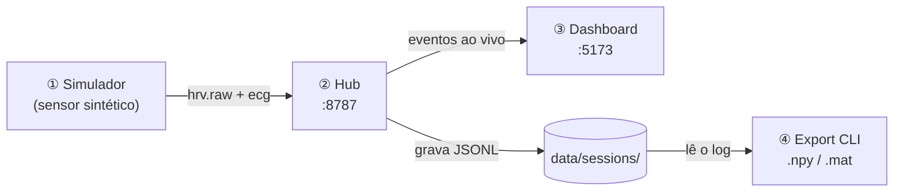
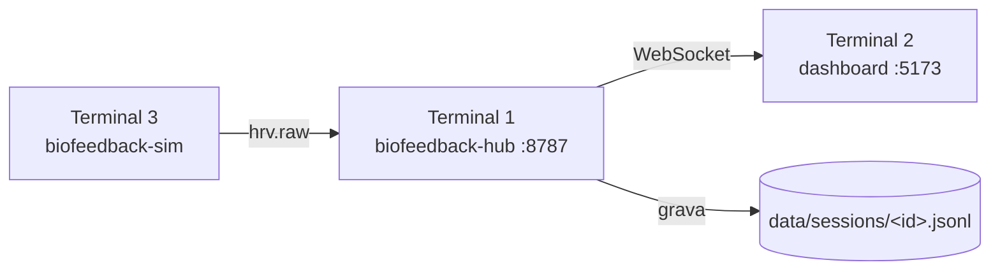

# Passo a Passo — Usando a Plataforma Biofeedback Hub

Guia prático e direto para **instalar, subir e usar** a plataforma ponta a ponta,
**sem precisar de hardware** (usando ECG sintético). Ao final você terá rodado as
**4 features**: cadastro do **Subject** → configuração de **Recording** → **Live** → **Export** `.npy`/`.mat`.

> Já tem o sistema rodando e quer só entender a arquitetura? Veja [GUIA-PROJETO.md](GUIA-PROJETO.md).
> Quer o runbook resumido das features? Veja [COMO-USAR.md](COMO-USAR.md).

---

## Visão geral em 30 segundos

A plataforma são **4 módulos** que conversam entre si:



| # | Módulo | O que faz | Onde roda |
|---|--------|-----------|-----------|
| 1 | **Simulador** (ou Polar H10 real) | Gera/colhe ECG e métricas de HRV | terminal |
| 2 | **Hub** | Broker central: recebe, valida, grava e reencaminha | `:8787` |
| 3 | **Dashboard** | Interface web: cadastro, controle e visualização | `:5173` |
| 4 | **Export CLI** | Converte a sessão gravada em `.npy`/`.mat` | terminal (sob demanda) |

---

## 0. Pré-requisitos (uma vez)

Você precisa de **Python 3.11+** e **Node.js LTS**. Para conferir:

```powershell
python --version    # esperado: Python 3.11.x ou superior
node --version      # esperado: v20+ (testado em v24)
```

Se faltar algum:

```powershell
winget install Python.Python.3.11
winget install OpenJS.NodeJS.LTS
# feche e reabra o terminal depois de instalar
```

---

## 1. Instalação (uma vez)

Abra um terminal **PowerShell** na pasta do projeto (`HUB-NOSSO/`).

### 1.1. Hub + simulador (Python)

```powershell
cd hub-ue
python -m venv .venv
.\.venv\Scripts\python -m pip install -e apps\hub
```

Isso instala o servidor do hub e os CLIs (`biofeedback-hub`, `biofeedback-sim`, etc.).

### 1.2. Dashboard (Node)

```powershell
# ainda dentro de hub-ue
npm install
```

### 1.3. Export (Python — só se for exportar `.npy`/`.mat`)

```powershell
cd ..\polarh10_driver
python -m venv .venv
.\.venv\Scripts\python -m pip install numpy scipy
cd ..\hub-ue
```

> ✅ Pronto. A instalação não precisa ser repetida nas próximas vezes — pule direto para o passo 2.

---

## 2. Subir a stack (3 terminais)

Abra **três terminais** PowerShell, todos na pasta `hub-ue/`. Suba **nesta ordem**:

### Terminal 1 — Hub

```powershell
cd hub-ue
.\.venv\Scripts\biofeedback-hub
```

Confirme que subiu (em outro terminal ou no navegador):

```powershell
Invoke-RestMethod http://127.0.0.1:8787/health
```

Deve responder `ok = True` e um `sessionId` no formato `session-...`. **Anote esse sessionId** — você vai usar no Export (passo 6).

### Terminal 2 — Dashboard

```powershell
cd hub-ue
npm run dev:dashboard
```

Abra **http://127.0.0.1:5173** no navegador. No topo deve aparecer **● Connected** e o `session-...`.

### Terminal 3 — Simulador (sensor sintético com ECG)

```powershell
cd hub-ue
.\.venv\Scripts\biofeedback-sim --mode hrv-ecg
```

> 💡 Use `--mode hrv-ecg` para ter **ECG ao vivo** na aba Live. O modo `--mode hrv` envia só HR/RR (sem waveform).

Para confirmar que o sensor conectou:

```powershell
Invoke-RestMethod http://127.0.0.1:8787/status | Select-Object -ExpandProperty clients
```

Deve listar um cliente `hrv-ecg-sim` com `role = sensor` e `messageCount` crescendo.



---

## 3. Feature 1 — Cadastrar o sujeito (aba **Subject**)

No dashboard (http://127.0.0.1:5173):

1. Clique em **Subject** na barra lateral.
2. Preencha o **Subject ID** (use um pseudônimo, ex.: `S-2026-014` — nunca dados pessoais reais).
3. Preencha os campos de demografia e **confundidores** (cafeína, sono, exercício, etc.).
4. Marque **"Consinto com a coleta..."**.
5. O selo deve mudar para **"Pronto para iniciar"**.

> O perfil fica salvo no navegador (localStorage) e é anexado à experiência quando você der Start.

---

## 4. Feature 2 — Configurar a gravação (aba **Recording**)

1. Clique em **Recording**.
2. Escolha o **modo**:
   - **Stream-only** — só transmite ao vivo, não grava.
   - **Record** — grava para análise posterior.
   - **Hybrid** — faz os dois.
3. Em **Sensores e sinais**, marque os sinais do `hrv-ecg-sim` (ECG / RR / HR).
4. Opcional: marque **"Capturar ECG bruto em arquivo"**.

> Essa configuração (`capture`) é publicada junto do evento de início da experiência.

---

## 5. Feature 3 — Iniciar e ver ao vivo (**Session Control** + **Live**)

1. Vá em **Session Control** → **Start experience**.
   - Isso publica `experience.lifecycle started` com o **subject + capture**.
2. Abra a aba **Live**:
   - 🟢 **ECG ao vivo** no canvas (porque o sim está em `--mode hrv-ecg`);
   - gráficos de **HR/RR** e os valores atuais de **BPM/RR**.
3. Durante a sessão você pode usar **markers** (Add marker) e acompanhar a **timeline**.
4. Ao terminar: **Session Control → End experience**.
   - Publica `experience.lifecycle ended` e abre o **Report** (exportável em JSON/CSV, já com `subject`/`capture` embutidos).

---

## 6. Feature 4 — Exportar `.npy` / `.mat`

O exportador lê o **log JSONL do hub** (`hub-ue/data/sessions/`), então funciona mesmo sem hardware.

Num **novo terminal**, na pasta `polarh10_driver/`:

```powershell
cd polarh10_driver
```

Descubra o **sessionId** (está no topo do dashboard) ou pegue via comando:

```powershell
Invoke-RestMethod http://127.0.0.1:8787/health | Select-Object -ExpandProperty sessionId
```

Exporte (troque `<sessionId>` pelo valor real):

```powershell
# ECG bruto -> NPY
.\.venv\Scripts\python -m tools.export_cli --session <sessionId> `
  --sessions-dir ..\hub-ue\data\sessions --signal ecg --format npy --out ecg.npy

# RR -> MAT
.\.venv\Scripts\python -m tools.export_cli --session <sessionId> `
  --sessions-dir ..\hub-ue\data\sessions --signal rr --format mat --out rr.mat
```

**Saída:** o arquivo binário (`ecg.npy` / `rr.mat`) **+** um sidecar `ecg.meta.json` com `subject` + `capture` + `run`.

| Opção | Valores aceitos |
|---|---|
| `--signal` | `ecg`, `rr`, `hr` |
| `--format` | `npy`, `mat` |

---

## 7. Encerrando

- **Parar cada módulo:** vá no terminal correspondente e pressione `Ctrl + C`.
- **Atalho que sobe hub + sim juntos** (hub na porta 8788): `npm run dev:demo` — para parar: `npm run dev:demo:stop`.

---

## 8. Mapa das abas do dashboard

| Aba | Para quê |
|---|---|
| **Guia** | Guia de uso embutido (este passo a passo, resumido, com atalhos para as abas) |
| **Overview** | Saúde do sistema, sensores, eventos recentes |
| **Live** | ECG ao vivo (canvas) + HR/RR |
| **Subject** | Cadastro do sujeito + confundidores + consentimento |
| **Recording** | Modo de gravação + seleção de sensores/sinais |
| **Session Control** | Start/End experience, markers, timeline, Report/exports |
| **Clients** | Clientes conectados ao hub |
| **Topics** | Stream de eventos por tópico |
| **Diagnostics** | Endpoint/token do hub |

---

## 9. Portas e endpoints

| Serviço | Endereço |
|---|---|
| Hub — health / status | http://127.0.0.1:8787/health · `/status` |
| Hub — WebSocket | `ws://127.0.0.1:8787/ws` |
| Dashboard | http://127.0.0.1:5173 |
| Driver Polar (real) — stream | `ws://localhost:8765/stream` |
| Hub no modo demo | http://127.0.0.1:8788 |

---

## 10. Resolução de problemas

| Sintoma | Causa provável / solução |
|---|---|
| Dashboard mostra **Disconnected** | Suba o **hub antes** do dashboard. Confira `http://127.0.0.1:8787/health`. |
| Dashboard **sem dados de sensor** | O sim (Terminal 3) não está rodando, ou subiu antes do hub. Reinicie na ordem do passo 2. |
| Aba **Live** sem ECG | Use `--mode hrv-ecg` (não `--mode hrv`) no simulador. |
| Sensor aparece 🟡 **Stale** | Sem amostra há >5 s — o sim parou. Reinicie o Terminal 3. |
| `biofeedback-hub` não encontrado | Você não ativou o venv certo. Use o caminho completo `.\.venv\Scripts\biofeedback-hub`. |
| Faltam `fastapi`/`uvicorn` | Rode `.\.venv\Scripts\python -m pip install -e apps\hub` dentro de `hub-ue`. |
| Export: "nenhuma amostra" | A sessão não tem ECG gravado. Use o sim em `--mode hrv-ecg` e confirme o `sessionId` certo. |
| `venv_setup.sh` não roda no Windows | É script bash; use os comandos PowerShell deste guia. |

---

## 11. Usando o Polar H10 real (em vez do simulador)

Troque o **Terminal 3** (simulador) por dois processos — o driver e a ponte:

**Driver** (em `polarh10_driver/`, precisa do `requirements.txt` instalado e do endereço BLE certo em `config/config.yaml`):

```powershell
cd polarh10_driver
.\.venv\Scripts\python -m pip install -r requirements.txt
.\.venv\Scripts\python main.py
```

**Ponte** (no venv do **hub**):

```powershell
cd hub-ue
.\.venv\Scripts\biofeedback-polarh10 --disable-recording-control
```

> ⚠️ Use `--disable-recording-control`: o endpoint `/control` de gravação ainda não existe no driver atual. A telemetria (`/stream` → `hrv.raw`) funciona normalmente.

Detalhes completos (escaneamento BLE, config) na seção 6 do [GUIA-PROJETO.md](GUIA-PROJETO.md).

---

## Para aprofundar

- [README.md](README.md) — visão geral do monorepo.
- [GUIA-PROJETO.md](GUIA-PROJETO.md) — arquitetura visual e como os módulos se conectam.
- [COMO-USAR.md](COMO-USAR.md) — runbook resumido das features.
- [hub-ue/docs/architecture.md](hub-ue/docs/architecture.md) · [hub-ue/docs/protocol.md](hub-ue/docs/protocol.md) — internals do hub.
