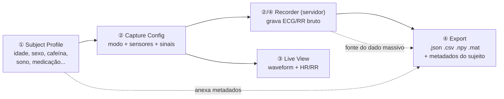
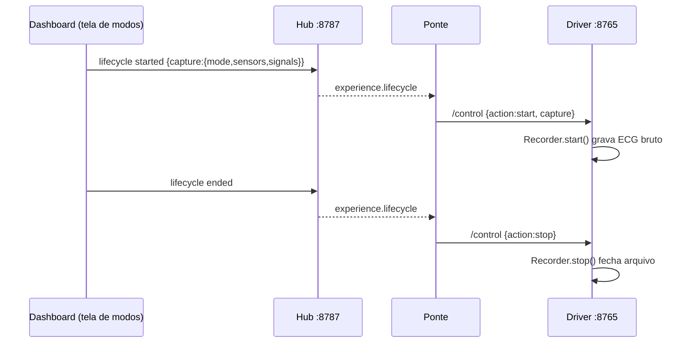
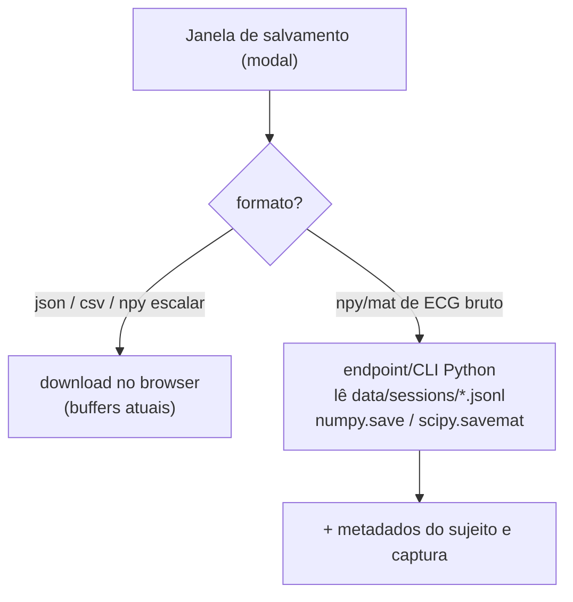
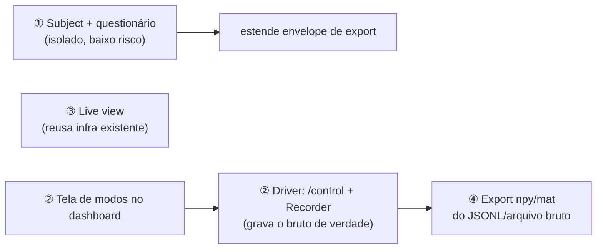
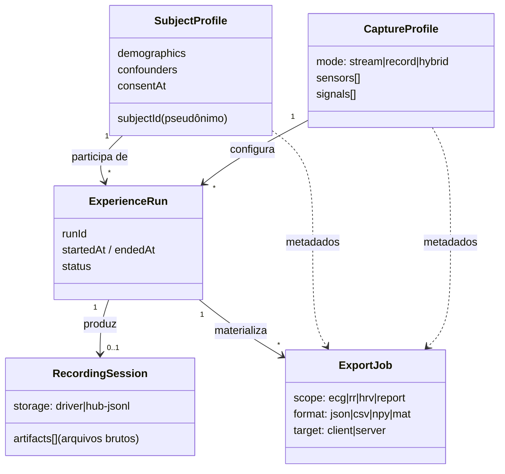
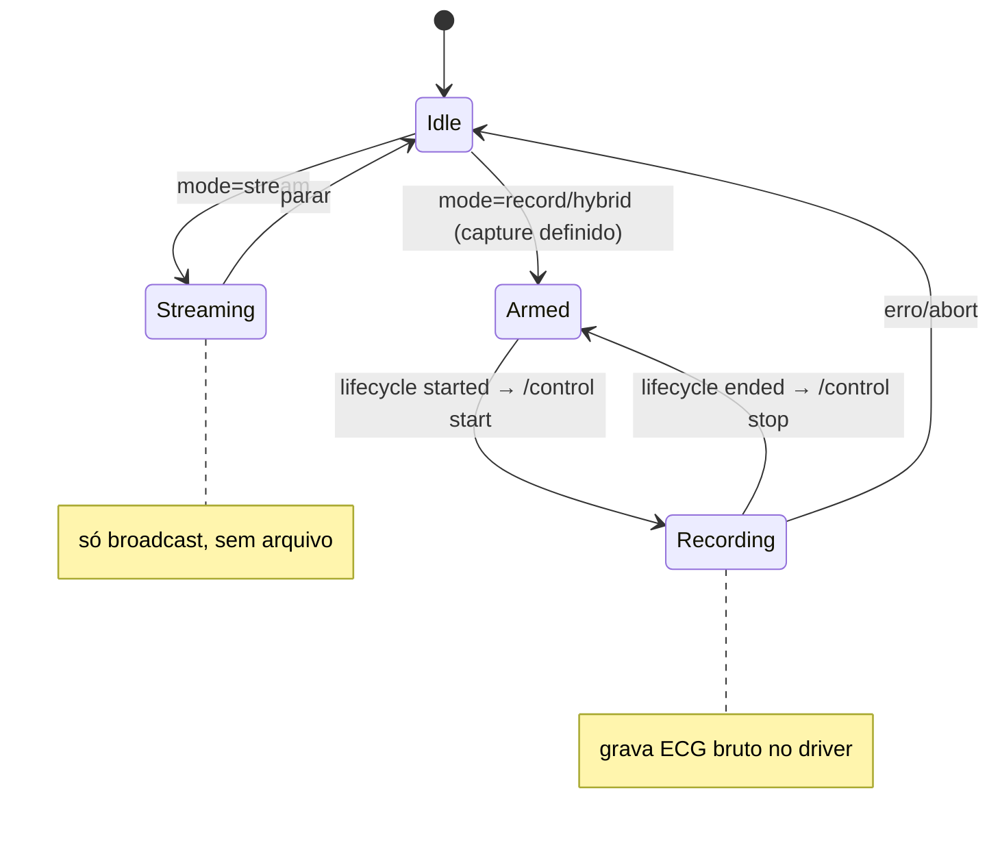
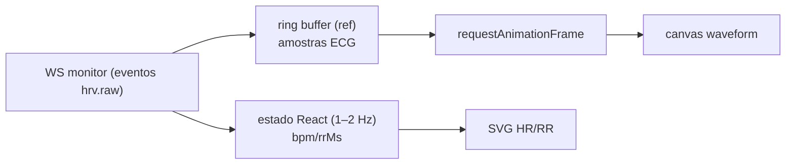
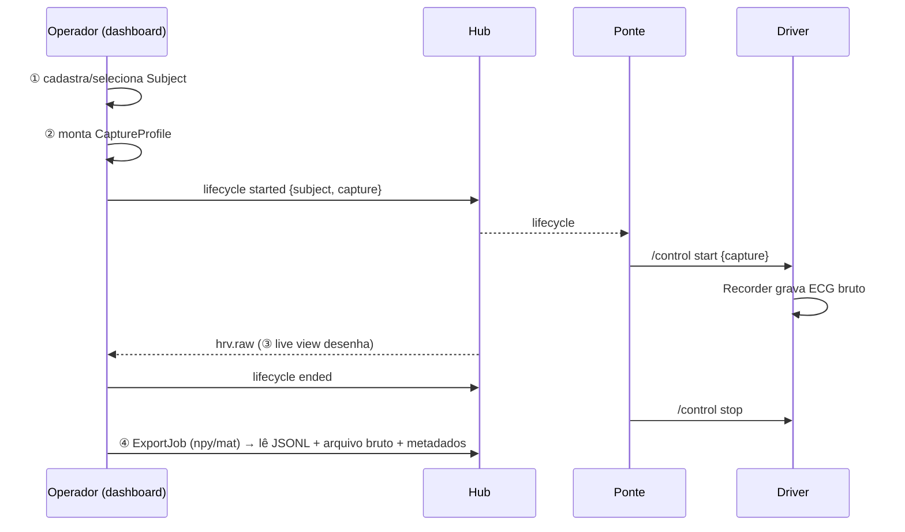

# Plano de Implementação — Novas Exigências do Cliente

Documento de planejamento (análise + caminho técnico) para **4 novas exigências** sobre o sistema **Biofeedback Hub + Polar H10**. Nada aqui está implementado ainda; este é o mapa de **o que já existe** e **como construir**.

Companheiro de leitura: [GUIA-PROJETO.md](GUIA-PROJETO.md) (como o sistema funciona hoje).

## Exigências

1. Interface de **cadastro da pessoa**, com perguntas sobre fatores fisiológicos que podem interferir na análise.
2. **Modos de gravação** + tela de seleção (tipos de sensores e dados a capturar).
3. Seção de **visualização de dados ao vivo**.
4. **Janela de salvamento** com formatos de dado massivo (`.npy`, `.mat`).

---

## 0. Três descobertas que guiam todo o plano

| # | Descoberta | Impacto |
|---|---|---|
| A | **O "record mode" do driver não existe de fato.** [config.yaml](polarh10_driver/config/config.yaml) declara `mode`, `recording.*` e `stream.send_*`, mas [main.py](polarh10_driver/main.py) só faz *stream + gateway*. O endpoint `/control` que a ponte chama **não existe**. | A exigência ② é majoritariamente **Python green-field**, não UI. |
| B | **O navegador não retém dado massivo.** [experiencePersistence.ts](hub-ue/apps/dashboard/src/experiencePersistence.ts) (`sanitizeHrvPayload`) descarta `ecg[]` e `ibiMs[]`; `events` é limitado a 200 e `experienceEvents` a 5000. | A exigência ④ (ECG bruto em `.npy`/`.mat`) **tem que ser server-side**. |
| C | **O dado bruto completo já está no servidor.** O hub grava todo envelope em `data/sessions/<sessionId>.jsonl` ([session_log.py](hub-ue/apps/hub/src/biofeedback_hub/core/session_log.py)). | É a fonte natural para gerar `.npy`/`.mat`. |

---

## 1. Visão consolidada

| # | Exigência | Já existe? | Onde construir | Complexidade |
|---|---|---|---|---|
| 1 | Cadastro da pessoa + confundidores | ❌ Sem conceito de "subject". ✅ Padrão de persistência/export reusável | Dashboard (módulo + tela) + payload de lifecycle | 🟢 Baixa |
| 2 | Modos de gravação + seleção | 🟡 Config declarada, ponte com hooks; **nada funcional** | Driver (Python) + tela no dashboard + protocolo | 🔴 Alta |
| 3 | Visualização ao vivo | 🟡 Tabela "Live sensor data" + chart SVG só no Report; waveform só no driver | Dashboard (view "Live" reusando SVG/canvas) | 🟡 Média |
| 4 | Salvamento `.npy`/`.mat` | 🟡 Exports JSON/CSV client-side; ❌ binário/massivo | Ferramenta/endpoint Python (numpy/scipy) + modal | 🟡 Média |

### Modelo de dados unificador

As 4 exigências formam uma cadeia **Sujeito → Captura → Gravação → Exportação**:



O perfil do sujeito (①) e a config de captura (②) precisam **viajar junto com o dado** até a exportação (④). Hoje o envelope de export ([experienceReport.ts](hub-ue/apps/dashboard/src/experienceReport.ts), `ReportExportEnvelopeV1`) **não tem** campo de sujeito nem de captura — é o primeiro ponto a estender.

---

## ① Cadastro da pessoa + questionário de confundidores

**Já existe:** nenhum conceito de sujeito. Mas há um molde de persistência versionada em [experiencePersistence.ts](hub-ue/apps/dashboard/src/experiencePersistence.ts) e um molde de formulário (marker form) em [App.tsx](hub-ue/apps/dashboard/src/App.tsx).

**Campos sugeridos:**
- *Basais:* `subjectId` (pseudônimo), idade, sexo biológico, altura, peso, lateralidade, posição de medição (sentado/deitado).
- *Confundidores de HRV* (bem documentados na literatura): cafeína (h desde última dose), nicotina, álcool (24h), horas de sono, exercício recente, refeição recente, medicação (ex.: β-bloqueador), nível de estresse, condições cardíacas (arritmia), fatores respiratórios/hormonais quando aplicável.

**Tarefas:**
- [ ] `apps/dashboard/src/subjectProfile.ts`: tipos + persistência em `localStorage` espelhando `experiencePersistence.ts` (versão de schema, validação, load/save/clear).
- [ ] Tela "Subject" em `NAV_ITEMS` ([App.tsx](hub-ue/apps/dashboard/src/App.tsx)) **ou** modal obrigatório antes de **Start experience** (reusar o gating `canDispatch...`).
- [ ] Anexar snapshot do perfil em `startExperienceRun` ([experienceRun.ts](hub-ue/apps/dashboard/src/experienceRun.ts)).
- [ ] Adicionar `subject` ao `ReportExportEnvelopeV1` ([experienceReport.ts](hub-ue/apps/dashboard/src/experienceReport.ts)) — subir `schemaVersion` para 2 (ou campo opcional).
- [ ] Incluir snapshot no `payload` de `experience.lifecycle` `started` para o log do servidor capturar; documentar em [docs/protocol.md](hub-ue/docs/protocol.md).
- [ ] Testes (seguir o padrão `*.test.ts` existente).

**Cuidados:** dado pessoal. [AGENTS.md](hub-ue/AGENTS.md) proíbe commitar dado sensível/logs. Usar **IDs pseudônimos**, manter local, nunca no git (LGPD/consentimento).

---

## ② Modos de gravação + tela de seleção

A mais pesada: exige **trabalho real no driver Python**.

**Já existe (mas não funciona):**
- [config.yaml](polarh10_driver/config/config.yaml): `mode`, `recording.*`, `stream.send_ecg/send_rr/send_hr` — lidos por `data_loader.py`, nunca aplicados.
- A ponte ([polarh10_client.py](hub-ue/apps/hub/src/biofeedback_hub/tools/polarh10_client.py)) já tem `send_recording_command()` mirando `ws://localhost:8765/control` — **endpoint inexistente**.
- Multi-sensor já funciona (`biofeedback-sim --mode multi-sensor`) e o dashboard descobre sensores via `/status` + assina tópicos dinamicamente.

**Fluxo alvo:**



**Tarefas — Driver (Python):**
- [ ] Endpoint `@app.websocket("/control")` no gateway ([websocket_gateway.py](polarh10_driver/core/websocket_gateway.py)) aceitando `{type:"recording", action:"start"|"stop", runId, capture}`.
- [ ] `core/recorder.py`: abre/fecha arquivo, grava ECG bruto + timestamps (começar em CSV/JSONL; `.npy`/`.mat` vem na ④).
- [ ] Aplicar `mode` em [main.py](polarh10_driver/main.py) (`stream`/`record`/`hybrid`) e respeitar `stream.send_ecg/rr/hr` para filtrar payload.

**Tarefas — Dashboard (UI):**
- [ ] Tela/modal "Recording mode": cartões **Stream-only / Record / Hybrid**.
- [ ] Seleção de **sensores** (checkbox a partir de `/status`) e de **sinais** (ECG bruto / RR / HR / HRV / EEG / IMU…), com "dado a capturar" (bruto vs. métricas).
- [ ] Empacotar como `CaptureConfig` e publicar estendendo o `payload` de `experience.lifecycle started` com `capture: {mode, sensors[], signals[]}`.

**Tarefas — Protocolo:**
- [ ] Documentar `capture` e `/control` em [docs/protocol.md](hub-ue/docs/protocol.md).
- [ ] Remover/ajustar a necessidade de `--disable-recording-control` na ponte quando `/control` existir.

**Cuidados:** a fonte da verdade de quais sensores existem é o `/status` do hub. O dashboard **pede** um modo; quem **grava o bruto** é o driver (ECG) e o hub (JSONL). Definir o dono de cada arquivo para não duplicar.

---

## ③ Visualização de dados ao vivo

**Já existe:**
- Hub dashboard: só a **tabela** "Live sensor data" e o **gráfico SVG no Report** (pós-experiência) — `BiometricTimelineChart`/`buildBiometricChartModel` em [experienceAnalytics.ts](hub-ue/apps/dashboard/src/experienceAnalytics.ts) e [App.tsx:1695](hub-ue/apps/dashboard/src/App.tsx#L1695). O código diz *"Aggregated trend view; exports keep raw samples"*.
- Waveform ECG ao vivo existe **só na página do driver** (Chart.js em `:8765`).
- O WS monitor já entrega eventos em tempo real; os eventos **vivos** ainda contêm o `ecg[]` (antes de sanitizar).

**Tarefas:**
- [ ] View "Live" em `NAV_ITEMS` (ou aba em Session Control) com 2 painéis: **waveform ECG** e **tendência HR/RR**.
- [ ] HR/RR: reusar infra SVG (sliding window dos escalares).
- [ ] ECG (130 Hz): **canvas + ring buffer num `ref`** + `requestAnimationFrame` (como o driver, `MAX_POINTS=800`). **Não** dar `setState` por amostra; ler do buffer vivo (com `ecg`) e, se preciso, subir o cap de 200 ou manter ref dedicado.
- [ ] *Alternativa rápida:* `<iframe src="http://localhost:8765/">` para o waveform e o dashboard cuida só das métricas.

**Cuidados:** performance. 130 Hz × N sensores estoura o React se virar `setState` por amostra — manter dado bruto fora do estado React.

---

## ④ Janela de salvamento com `.npy` / `.mat`

**Já existe:** exports JSON/CSV via `downloadTextFile` ([App.tsx](hub-ue/apps/dashboard/src/App.tsx)), a partir de buffers do browser (limitados e sem ECG bruto). Nada binário.

**Decisão de arquitetura:** `.npy`/`.mat` de **dado massivo (ECG)** = **server-side**. Porque (a) o navegador descarta o ECG e limita o buffer, e (b) `.npy`/`.mat` numéricos pedem **numpy/scipy** — que o **driver já tem** ([requirements.txt](polarh10_driver/requirements.txt)) e o **hub não** (só fastapi/pydantic/uvicorn/websockets, ver [pyproject.toml](hub-ue/apps/hub/pyproject.toml)).



**Tarefas:**
- [ ] Ferramenta/CLI Python `biofeedback-export --session <id> --signal ecg|rr|hr --format npy|mat`, lendo o JSONL de `data/sessions/`, embutindo metadados do sujeito (①) e da captura (②). `.npy` via `numpy.save`; `.mat` via `scipy.io.savemat`. (Decidir se vive no driver, que já tem numpy/scipy, ou um pacote novo.)
- [ ] (Opcional) endpoint `GET /export?session=...&format=npy` para o botão "Salvar" baixar direto.
- [ ] (Opcional) `.npy` **escalar** client-side (RR/HR) — formato simples (cabeçalho ASCII + buffer little-endian) gerável de um `Float64Array`. `.mat` v5 fica no servidor.
- [ ] Modal "Janela de salvamento": formato × escopo (ECG bruto / RR / HRV / Report) **roteando** texto = client-side, binário/massivo = servidor.

---

## Ordem recomendada de implementação



1. **① Sujeito** — isolado, baixo risco, prepara o envelope de export que ④ precisa.
2. **② Gravação no driver** (`/control` + Recorder) — pré-requisito de ter dado massivo persistido; destrava ④.
3. **④ Export `.npy`/`.mat`** server-side a partir do que ② grava.
4. **③ Live view** — pode ir em paralelo (reusa o que já existe).

---

## Riscos principais a alinhar com o cliente

| Risco | Detalhe |
|---|---|
| Dado massivo não nasce no browser | Exige gravação server-side (driver/hub). Sem isso, ④ entrega só séries escalares pequenas. |
| `/control` e record mode são green-field | A maior parte do esforço de ② é Python, não React. |
| Privacidade do ① (LGPD) | IDs pseudônimos; nada de dado pessoal no git. |
| Performance do ③ | Canvas + ring buffer obrigatórios para ECG a 130 Hz. |

---

## Plano conceitual de implementação

Esta seção descreve **como eu desenharia** as features dentro da arquitetura atual — conceitos, entidades, contratos e fluxos — antes de qualquer código.

### Princípios de design (transversais)

| Princípio | O que significa aqui |
|---|---|
| **Local-first** | Tudo roda na máquina do operador; nada de nuvem obrigatória. Mantém o estilo atual (`localStorage` + hub local). |
| **Contrato por tópico** | Features novas entram como **tópicos/payloads** no envelope existente, não como endpoints ad-hoc. Mantém o hub agnóstico ([protocol.md](hub-ue/docs/protocol.md)). |
| **Servidor é a fonte da verdade do dado bruto** | O browser é uma **janela de operação**, não o sistema de registro. ECG bruto vive no driver/JSONL; o dashboard só amostra. |
| **Separar captura × gravação × visualização × exportação** | São 4 responsabilidades distintas: *configurar* (CaptureProfile), *executar* (Recorder), *observar* (LiveView), *materializar* (ExportJob). Cada uma evolui sozinha. |
| **Schema versionado e retrocompatível** | Todo artefato persistido/exportado carrega `schemaVersion`. Já é o padrão ([experiencePersistence.ts](hub-ue/apps/dashboard/src/experiencePersistence.ts), `ReportExportEnvelopeV1`). |
| **Privacidade by design** | Sujeito = pseudônimo; dado pessoal nunca no git; consentimento explícito (LGPD). |

### Modelo conceitual de domínio

Quatro entidades novas e como se relacionam com o que já existe (`ExperienceRun`):



Formas conceituais (pseudo-schema, **não** é código):

```
SubjectProfile { subjectId, demographics{age,sex,height,weight,handedness,position},
                 confounders{caffeineH, nicotine, alcohol24h, sleepH, exercise,
                             meal, medication, stress, conditions[]}, consentAt }

CaptureProfile { mode, sensors:[clientId], signals:[ecg|rr|hr|hrv|eeg|imu], rawEcg:bool }

ControlMessage { type:"recording", action:"start|stop", runId, capture:CaptureProfile }

ExportEnvelopeV2 { schemaVersion:2, subject, capture, run, analytics, artifacts[] }
```

### ① Subject Registry — conceito

- **Conceito:** um `SubjectProfile` é criado/escolhido **antes** de iniciar a experiência e fica "preso" ao `ExperienceRun` como snapshot imutável (se o sujeito atualizar dados depois, a run antiga preserva o que era válido naquele momento).
- **Ciclo de vida:** `rascunho → confirmado (consentAt) → vinculado à run → arquivado no export`.
- **Onde vive:** `localStorage` (registro local reusável entre sessões) **e** snapshot no `payload` do `experience.lifecycle started` (para o JSONL do hub guardar o contexto junto do dado).
- **Wireframe:**

```text
┌── Subject ───────────────────────────────────────────────┐
│ Subject ID: [ S-2026-014        ]   (pseudônimo)         │
│ Idade [ 27 ]  Sexo [▼ F ]  Altura [168] Peso [62]        │
│ Posição de medição:  (•) Sentado  ( ) Deitado            │
│── Fatores que afetam a HRV ──────────────────────────────│
│ Cafeína (h): [ 3 ]   Álcool 24h: ( )Sim (•)Não           │
│ Sono (h): [ 6.5 ]    Exercício recente: (•)Sim ( )Não    │
│ Medicação: [ nenhuma            ]  Estresse: [▼ médio ]  │
│ Condições: [x] nenhuma  [ ] arritmia  [ ] ...            │
│ [ ] Consinto com a coleta (obrigatório p/ iniciar)       │
│                                  [ Salvar e vincular ▶ ] │
└──────────────────────────────────────────────────────────┘
```

### ② Capture Profile & Recording Modes — conceito

- **Conceito central:** transformar o "modo" de string solta no config num **objeto de 1ª classe** (`CaptureProfile`) que o dashboard monta, o hub transporta e o driver executa. A config do driver vira o **default**, não a única fonte.
- **Máquina de estados do modo:**



- **Canal de controle:** o `/control` (a criar no driver) é o **executor**; o dashboard nunca fala direto com o driver — sempre via hub → ponte → `/control`. Mantém o desacoplamento.
- **Matriz de seleção (conceito da tela):** sensores (linhas, vindos de `/status`) × sinais (colunas). Cada célula marcável define o que capturar.

```text
┌── Recording mode ────────────────────────────────────────┐
│ Modo:  ( ) Stream-only   (•) Record   ( ) Hybrid         │
│                                                          │
│ Sensor \ Sinal     ECG  RR   HR   HRV                    │
│ polar-h10          [x]  [x]  [x]  [x]                    │
│ eeg-node-2         [ ]  --   --   --                     │
│ Capturar ECG bruto p/ arquivo: [x]                       │
│                                   [ Aplicar e iniciar ▶ ]│
└──────────────────────────────────────────────────────────┘
```

### ③ Live Visualization — conceito

- **Conceito:** um **pipeline de renderização desacoplado do React**. Os samples entram num *ring buffer* num `ref`; um laço `requestAnimationFrame` desenha no `<canvas>`. O React só re-renderiza rótulos/estatísticas (1–2 Hz), nunca a forma de onda (130 Hz).
- **"Lanes" por sinal:** cada sinal é uma faixa independente (waveform ECG = canvas; HR/RR = SVG sliding-window, reusando `buildBiometricChartModel`). Multi-sensor = múltiplas lanes empilhadas.



```text
┌── Live ──────────────────────────────────────────────────┐
│ polar-h10   [🟢 Streaming]   BPM 73   RR 821ms           │
│ ECG  ╱╲___╱╲____╱╲___╱╲____  (canvas, rolando)           │
│ HR   ▁▂▃▄▅▆▅▄▃▂  RR ▃▄▅▄▃▄▅  (svg, janela 60s)          │
└──────────────────────────────────────────────────────────┘
```

### ④ Export / Save — conceito

- **Conceito:** um `ExportJob` é definido por **escopo × formato × destino**. O destino é **derivado automaticamente** do par escopo/formato (regra, não escolha do usuário):

| Escopo \ Formato | json | csv | npy | mat |
|---|---|---|---|---|
| Report / resumo | client | client | — | — |
| RR / HR (escalar) | client | client | client¹/server | server |
| **ECG bruto (massivo)** | server | server | **server** | **server** |

¹ `.npy` escalar é gerável no browser; tudo massivo/`.mat` é server-side.

- **Envelope unificado:** todo export (qualquer formato) carrega o mesmo cabeçalho lógico `{subject, capture, run}` + o dado. Garante que o `.mat`/`.npy` chegue ao analista **com o contexto fisiológico** do sujeito (①) e a config de captura (②).

```text
┌── Salvar dados ──────────────────────────────────────────┐
│ Escopo:  ( ) Report  ( ) RR/HR  (•) ECG bruto            │
│ Formato: ( ) JSON  ( ) CSV  (•) NPY  ( ) MAT             │
│ Destino: servidor (lê data/sessions/…jsonl)  [auto]      │
│ Inclui: metadados do sujeito + captura  [x]              │
│                                          [ Gerar ▼ ]     │
└──────────────────────────────────────────────────────────┘
```

### Fluxo conceitual ponta a ponta



### Fases conceituais (MVP → completo)

| Fase | Entrega | Destrava |
|---|---|---|
| **0 — Fundação** | `schemaVersion` v2 no export + campos `subject`/`capture` opcionais | ① e ④ |
| **1 — Sujeito** | Subject Registry + binding na run (① completo) | contexto p/ exports |
| **2 — Gravação** | `/control` + Recorder no driver + tela de modos (② completo) | dado massivo persistido |
| **3 — Export massivo** | CLI/endpoint `.npy`/`.mat` server-side (④ completo) | entrega ao analista |
| **4 — Live** | View "Live" com canvas/ring buffer (③ completo) | observação em tempo real |

---

## Scaffolding já criado (Fase 0)

Os contratos, esqueletos, specs de teste e documentação de apoio **já existem** no repo
(sem lógica de feature — apenas a fundação para acelerar a implementação):

**Contratos + stubs (dashboard, TS):**
- [subjectProfile.ts](hub-ue/apps/dashboard/src/subjectProfile.ts) — tipos do sujeito + persistência + validação.
- [captureProfile.ts](hub-ue/apps/dashboard/src/captureProfile.ts) — `CaptureProfile` + builders + payload de lifecycle.
- [exportFormats.ts](hub-ue/apps/dashboard/src/exportFormats.ts) — `ExportJob`, regra client/server, **encoder `.npy` já funcional**.
- Specs Vitest: `subjectProfile.test.ts`, `captureProfile.test.ts`, `exportFormats.test.ts` (verdes; `it.todo` no que falta).

**Contrato (hub, Python):**
- [schemas/capture.py](hub-ue/apps/hub/src/biofeedback_hub/schemas/capture.py) — Pydantic: `SubjectProfile`, `CaptureProfile`, `RecordingControl`, `ExportEnvelopeV2`.
- [tests/test_capture_schemas.py](hub-ue/apps/hub/tests/test_capture_schemas.py).

**Esqueletos (driver, Python):**
- [core/recorder.py](polarh10_driver/core/recorder.py) — `Recorder` (start/write/stop, `NotImplementedError`).
- [core/control.py](polarh10_driver/core/control.py) — handler de `/control` + instruções de wiring no gateway.
- [tools/export_cli.py](polarh10_driver/tools/export_cli.py) — CLI `.npy`/`.mat` (numpy/scipy), com `load_jsonl` pronto.
- [test/test_export_cli.py](polarh10_driver/test/test_export_cli.py).

**Docs:**
- [docs/decisions-novas-features.md](hub-ue/docs/decisions-novas-features.md) — decision log (D1–D10).
- [docs/protocol.md](hub-ue/docs/protocol.md) — seção "Extensões propostas (schemaVersion 2)".

> Validação local pendente: `npm test`/`typecheck:dashboard` e `python -m unittest`
> não foram executados aqui (toolchains não instalados neste ambiente). Os arquivos
> seguem os padrões existentes; rodar essas verificações é o primeiro passo ao retomar.

---

## Arquivos de referência citados

- [polarh10_driver/main.py](polarh10_driver/main.py) · [config.yaml](polarh10_driver/config/config.yaml) · [websocket_gateway.py](polarh10_driver/core/websocket_gateway.py) · [requirements.txt](polarh10_driver/requirements.txt)
- [hub-ue/apps/hub/.../polarh10_client.py](hub-ue/apps/hub/src/biofeedback_hub/tools/polarh10_client.py) · [session_log.py](hub-ue/apps/hub/src/biofeedback_hub/core/session_log.py) · [pyproject.toml](hub-ue/apps/hub/pyproject.toml)
- [hub-ue/apps/dashboard/src/App.tsx](hub-ue/apps/dashboard/src/App.tsx) · [experiencePersistence.ts](hub-ue/apps/dashboard/src/experiencePersistence.ts) · [experienceReport.ts](hub-ue/apps/dashboard/src/experienceReport.ts) · [experienceAnalytics.ts](hub-ue/apps/dashboard/src/experienceAnalytics.ts) · [experienceRun.ts](hub-ue/apps/dashboard/src/experienceRun.ts) · [sensorTelemetry.ts](hub-ue/apps/dashboard/src/sensorTelemetry.ts)
- [hub-ue/docs/protocol.md](hub-ue/docs/protocol.md)
</content>
