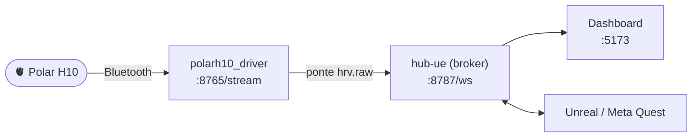

# HUB-NOSSO — Biofeedback Hub + Polar H10

Monorepo que reúne dois projetos que trabalham juntos para coletar, distribuir e
visualizar sinais fisiológicos (HRV/ECG) em tempo real, integrando sensores,
um hub central e experiências Unreal/Meta Quest.



## Projetos

| Pasta | O que é |
|---|---|
| [polarh10_driver/](polarh10_driver/) | Driver do sensor **Polar H10**: lê ECG por Bluetooth, detecta batimentos, calcula HRV (HR, RMSSD, SDNN, pNN50, LF/HF) e transmite por WebSocket. |
| [hub-ue/](hub-ue/) | **Hub central** (broker por tópicos em Python/FastAPI) + **dashboard** React/Vite + **plugin Unreal** `QuestSupervisor`. |

Os dois são unidos em runtime pela ponte `biofeedback-polarh10`, que lê o stream do
driver e publica no hub como tópico `hrv.raw`.

## Documentação

- **[GUIA-PROJETO.md](GUIA-PROJETO.md)** — guia visual de como o sistema funciona, como os projetos se conectam e como rodar (com e sem o Polar).
- **[PLANO-NOVAS-FEATURES.md](PLANO-NOVAS-FEATURES.md)** — análise + plano conceitual das novas features (cadastro do sujeito, modos de gravação, visualização ao vivo, export `.npy`/`.mat`).
- [hub-ue/docs/decisions-novas-features.md](hub-ue/docs/decisions-novas-features.md) — decisões em aberto.
- [hub-ue/docs/architecture.md](hub-ue/docs/architecture.md) · [hub-ue/docs/protocol.md](hub-ue/docs/protocol.md) — arquitetura e protocolo do hub.

## Quick start (sem o Polar)

Valida hub + dashboard sem hardware, usando o simulador de HRV. Na pasta `hub-ue/`:

```powershell
# preparar (uma vez)
python -m venv .venv
.\.venv\Scripts\python -m pip install -e apps\hub

# 3 terminais:
.\.venv\Scripts\biofeedback-hub                 # hub  (:8787)
npm install ; npm run dev:dashboard             # dashboard (:5173)
.\.venv\Scripts\biofeedback-sim --mode hrv      # sensor simulado
```

> Para ver a **waveform de ECG ao vivo** na aba **Live** sem o Polar, use
> `biofeedback-sim --mode hrv-ecg` (gera ECG sintético). O modo `hrv` envia só HR/RR.

O passo a passo completo (inclusive **com o Polar H10**) está em [GUIA-PROJETO.md](GUIA-PROJETO.md).

## Estrutura

```
HUB-NOSSO/
├── polarh10_driver/   # driver do sensor Polar H10
├── hub-ue/            # hub Python + dashboard + plugin Unreal
├── GUIA-PROJETO.md    # como funciona e como rodar
└── PLANO-NOVAS-FEATURES.md
```

> As novas features (cadastro do sujeito, modos de gravação, export `.npy`/`.mat` e
> visualização ao vivo) estão **implementadas** (Fases 0–4) e validadas por CI.
> Detalhes em [MUDANCAS.md](MUDANCAS.md).
