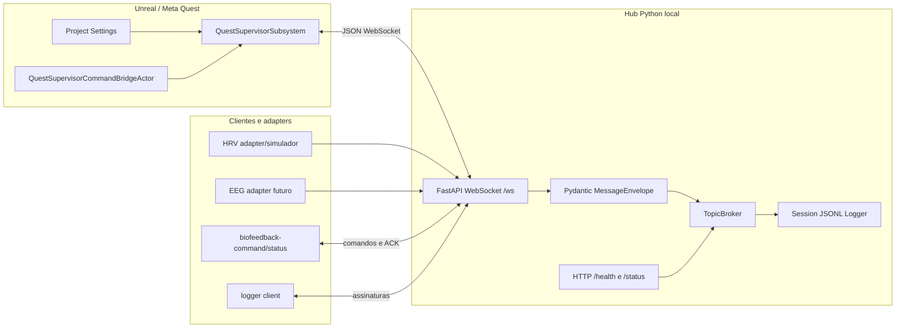

# Arquitetura

Este projeto é uma base local-first para conectar experiências Unreal/Meta Quest a um hub Python de biofeedback. O hub recebe mensagens de clientes e sensores, valida o envelope em tempo de execução, registra eventos localmente e redistribui mensagens por tópicos.

## Objetivo

O desenho atual prioriza:

- WebSocket puro para integração simples com Unreal/Quest;
- protocolo por tópicos, não por tipo fixo de dispositivo;
- validação com Pydantic no hub;
- logs locais em JSONL;
- plugin Unreal reaproveitável em projetos externos;
- interfaces futuras para adapters de HRV, EEG, wearables e outros sensores.

## Visão geral

## Componentes ativos

- `apps/hub`: aplicação FastAPI, WebSocket, broker, logger, simuladores e CLIs.
- `biofeedback_hub.schemas`: envelope versionado, tópicos e payloads base.
- `biofeedback_hub.core.broker`: registro de clientes, assinaturas por tópico e rastreamento de ACK.
- `biofeedback_hub.core.session_log`: logger append-only em JSONL.
- `biofeedback_hub.adapters`: interface inicial para adapters/simuladores de sensores.
- `unreal/Plugins/QuestSupervisor`: plugin Unreal canônico.
- `unreal/QuestSupervisorHost`: projeto Unreal mínimo para validar o plugin dentro deste repositório.

## Fluxo de mensagem

1. Um cliente conecta em `ws://<host>:8787/ws`.
2. O cliente envia `hello`.
3. O cliente assina tópicos com `subscribe`.
4. Um cliente publica em um tópico com `publish`.
5. O hub valida o envelope, carimba `hubReceivedAt`, salva log e encaminha a mensagem para assinantes.
6. Quando `requiresAck=true`, o hub rastreia os destinatários esperados.
7. O assinante responde com `ack`.
8. O hub encaminha o ACK ao publicador original, se ele ainda estiver conectado.

## Persistência

O modelo inicial é append-only em JSONL dentro de `data/sessions`. Essa escolha mantém o sistema simples de inspecionar, versionar e substituir por SQLite, Parquet ou outro armazenamento no futuro.

## Plugin Unreal

O plugin Unreal canônico fica em `unreal/Plugins/QuestSupervisor`. Projetos consumidores devem copiar essa pasta para `<ProjetoUnreal>/Plugins/QuestSupervisor`.
