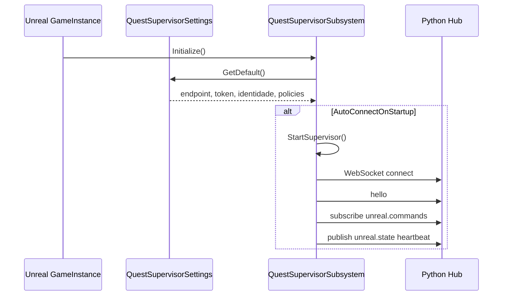
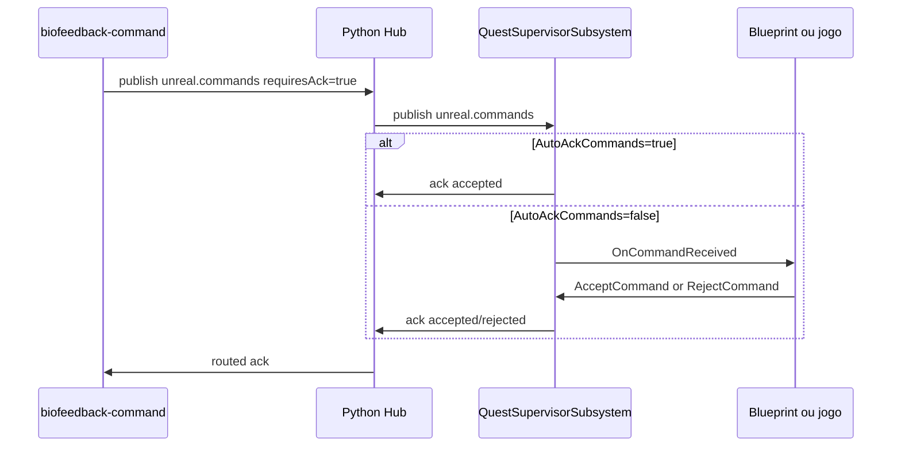

# Notas técnicas do plugin Unreal

Notas para desenvolvedores que vão manter ou evoluir o plugin `QuestSupervisor`.

## Objetivo

O plugin deixou de depender de bootstrap em `GameInstance` do projeto consumidor. A integração padrão agora é:

```text
Project Settings -> UQuestSupervisorSettings
             -> UQuestSupervisorSubsystem auto-start
             -> WebSocket hub
             -> Blueprint/C++ recebe comandos via delegate ou component
```

Isso torna o plugin reutilizável em qualquer projeto Unreal:

- C++ continua disponível para integrações avançadas;
- Blueprint passa a ser suficiente para instalar, conectar e responder comandos;
- o host do repositório vira exemplo técnico, não requisito de uso.

## Classes principais

### `UQuestSupervisorSettings`

Arquivo:

```text
unreal/Plugins/QuestSupervisor/Source/QuestSupervisor/Public/QuestSupervisorSettings.h
```

Expõe `Edit > Project Settings > Plugins > Quest Supervisor`.

Campos principais:

- `bSupervisorEnabled`
- `bAutoConnectOnStartup`
- `SupervisorEndpoint`
- `AuthToken`
- `bAutoAckCommands`
- intervalos de heartbeat/reconnect
- identidade do cliente Unreal
- capabilities anunciadas no `hello`

Os valores são salvos em:

```ini
[/Script/QuestSupervisor.QuestSupervisorSettings]
```

Overrides de teste suportados pelo plugin:

- `-QuestSupervisorEndpoint=host:porta`
- `-QuestSupervisorToken=token-local`

### `UQuestSupervisorSubsystem`

Arquivo:

```text
unreal/Plugins/QuestSupervisor/Source/QuestSupervisor/Public/QuestSupervisorSubsystem.h
```

É um `UGameInstanceSubsystem`. Ele centraliza:

- conexão WebSocket;
- reconnect com backoff;
- fila de mensagens quando o socket ainda não está pronto;
- `hello`;
- subscribe em `unreal.commands`;
- heartbeat em `unreal.state`;
- logs em `logger.events`;
- ACK automático ou manual.

Novas funções públicas:

- `StartSupervisor()`
- `StopSupervisor()`
- `ReloadSettings()`

Com `bAutoConnectOnStartup=true`, o subsystem chama `StartSupervisor()` durante `Initialize()`.

### `UQuestSupervisorComponent`

Arquivo:

```text
unreal/Plugins/QuestSupervisor/Source/QuestSupervisor/Public/QuestSupervisorComponent.h
```

É um `UActorComponent` `BlueprintSpawnableComponent`.

Uso esperado:

- adicionar em um Actor Blueprint;
- bindar `OnCommandReceived`;
- chamar `AcceptCommand` ou `RejectCommand`.
- chamar `SendExperienceMarker` ou o node simples **Send Experience Marker** para publicar eventos da experiencia em `experience.marker`.
- chamar **Start Experience** e **End Experience** para publicar `experience.lifecycle` e deixar o dashboard observar a janela real da experiencia XR.

Ele não possui socket próprio. Só encapsula o subsystem para deixar o fluxo ergonômico em Blueprint.

### `AQuestSupervisorCommandBridgeActor`

Arquivo:

```text
unreal/Plugins/QuestSupervisor/Source/QuestSupervisor/Public/QuestSupervisorCommandBridgeActor.h
```

Actor pronto para projetos consumidores colocarem no mapa sem C++.

Comportamento padrão:

- possui um `QuestSupervisorComponent`;
- aceita `pause-session`, `resume-session` e `add-marker`;
- publica `unreal.state` quando auto-aceita `pause-session` ou `resume-session`;
- publica `experience.marker` quando auto-aceita `add-marker` com `label`;
- rejeita ações desconhecidas;
- reexpõe os eventos `OnCommandReceived` e `OnTransportStateChanged` para Blueprint.

Esse Actor é útil para testes e para projetos que ainda não têm um Blueprint próprio de roteamento de comandos.

## Fluxo de startup



## Fluxo de comando



## Compatibilidade

As APIs antigas continuam válidas:

- `ConfigureSupervisorEndpoint`
- `RegisterDevice`
- `SendHeartbeat`
- `SendLogEntry`
- `SendExperienceMarker`
- `SendExperienceLifecycleEvent`
- `StartExperience`
- `EndExperience`
- `AcceptCommand`
- `RejectCommand`

Isso preserva projetos que já integraram em C++. A novidade é que um projeto novo não precisa escrever esse bootstrap.

## Exemplo Host

O projeto:

```text
unreal/QuestSupervisorHost
```

agora usa o auto-start do plugin via `DefaultGame.ini`. O `GameInstance` do host mantém apenas:

- bind do delegate `OnCommandReceived`;
- política de exemplo para aceitar `pause-session`;
- política de rejeição para ações desconhecidas;
- logs periódicos de diagnóstico.

Ele deve ser lido como exemplo técnico, não como passo obrigatório para consumidores.

## Próximas melhorias possíveis

- Adicionar presets Blueprint para comandos comuns, por exemplo `pause-session` e `resume-session`.
- Criar um painel Editor Utility Widget para testar conexão sem Play.
- Adicionar testes automatizados Unreal para parsing de comando e configuração.
- Versionar o plugin com `VersionName` e notas de migração por release.
